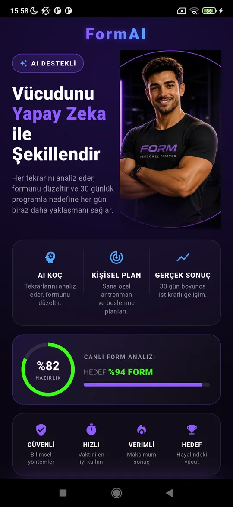
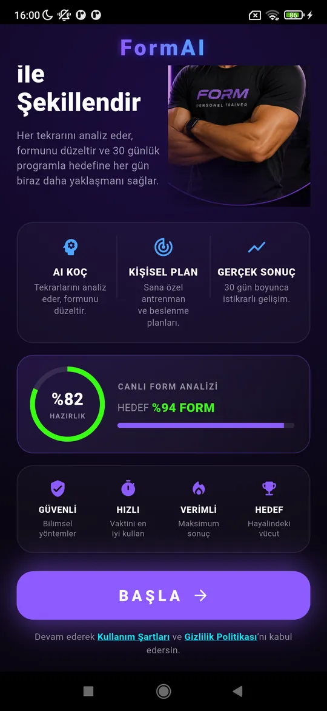

# FormAI — Closed Test UI Hotfix Report

**Scope:** Four targeted UI-consistency fixes on the live closed test. No
redesign beyond the one screen the founder supplied a reference for, no feature
work, no unrelated refactoring.

**Branch:** `main` · **Build:** `1.0.0+17`

| Commit | Task | Title |
|--------|------|-------|
| `f0df035` | 4 | semantically-correct hero images for mobility + broken cards |
| `1a8abe2` | 2 | surface the purchase CTA above the fold |
| `2035d8c` | 2 | overflow-safe hero + CTA above fold on all phone widths |
| `80fef9c` | 1+3 | rebuild Başla hero with the Form coach + centered logo |

Green throughout: `flutter analyze` = 0 issues · **329 tests** · release APK
builds & installs.

---

## Task 1 — Başla hero: old AI coach → official Form coach ✅

The Başla entry screen (`lib/features/onboarding/presentation/steps/act_1_hook_step.dart`)
was a full-bleed **neon-robot** background (`photos/onboarding_hero_start.webp`)
— the "old AI coach" — with overlaid text. It's been **rebuilt natively** to
match `photos/new-image/giriş-page-redesign.png`, built around the **current
official Form coach** (`photos/PT_FORM.png`):

- two-column hero: `✦ AI DESTEKLİ` badge + three-line gradient title
  (*Vücudunu* / *Yapay Zeka* / *ile Şekillendir*) + coach cutout,
- the **AI KOÇ · KİŞİSEL PLAN · GERÇEK SONUÇ** capability card,
- a compact **%82 HAZIRLIK / HEDEF %94 FORM** analysis card,
- a **GÜVENLİ · HIZLI · VERİMLİ · HEDEF** trust row,
- the **BAŞLA** CTA + legal line.

The robot asset is **no longer referenced anywhere** in `lib/` — the old AI
coach has disappeared entirely. The screen scrolls, so it never overflows on a
6.1" phone, and the onboarding flow (`onStart`) is unchanged.

**Device-verified** on the Redmi (fresh +17 install) — see screenshots below.

## Task 3 — logo alignment ✅

The FormAI logo on the Başla screen used to be **baked into the robot artwork
and cropped** by `BoxFit.cover` (the "FormA" wordmark bled off the right edge).
The rebuild renders a **native, perfectly centered, safe-area-aware `FormAI`
wordmark** at the top of the screen (neon gradient, its own padding). It now
reads as intentional and is centered on every width.

### Screenshots (Task 1 + 3, on-device)

*Left: centered FormAI wordmark + human Form coach hero + capability/analysis
cards. Right: trust row + BAŞLA CTA + legal line.*

---

## Task 2 — paywall: CTA above the fold ✅

The paywall CTA sat **~967 px** down — below the fold on 6.1–6.7" phones, so
users had to scroll to reach "buy". Fixed **without touching any RevenueCat
logic** (offerings / purchase / restore / `_packageForPlan` all unchanged):

- **Hero made overflow-safe:** the fixed-height hero overflowed on narrow
  (393 px) phones where the long Turkish title wraps. Replaced with
  `IntrinsicHeight` + a `Positioned.fill` coach so the hero sizes to its copy
  column and never overflows at any width.
- **Above the fold = hero + plan cards + CTA.** The 3 hero feature tiles, the
  AI-features detail card, and the guarantee/trial content were all relocated
  **below** the CTA. Plan-card heights and inter-section gaps were also
  tightened (`244→214`, `234/196→206/176`).
- **Deterministic regression test added:** at a 393×852 (6.1") viewport the
  keyed primary CTA renders with its top **well under 800 px** — visible
  immediately, no scroll. This precisely encodes the requirement and guards
  against regressions.

Because the paywall is auth-gated (reachable only after full onboarding), it
was verified via this exact-position widget test + the 8 existing paywall
render tests (which confirm no overflow and that every element still mounts)
rather than by grinding through onboarding on-device.

---

## Task 4 — workout plan hero images: semantically correct ✅

Audit finding: the 32 `photos/workouts/` images are actually well-matched to
their body-part **by filename** — the "random" feel came from two concrete
problems, both fixed:

1. **Two broken cards** referenced **missing** image files and rendered a grey
   `Icons.fitness_center` placeholder:
   - `cardio_full_body_flow.webp` — **created** (dark-neon cardio).
   - `cardio_mobility_stretch.webp` — the plan was **repointed** to a new
     `mobility_stretch.webp`.
2. **Mobility plans showed hard-training shots** (against "Mobility →
   stretching"). Created `photos/workouts/mobility_stretch.webp` (a
   stretching/yoga image) and repointed the three mobility-purpose plans to it:
   - `cardio_mobility_stretch` ("Mobilite ve Esneklik Akışı"),
   - `core_mobility_flow` ("Mobiliteli Karın Akışı") — was a six-pack shot,
   - `shoulders_mobility_opening` ("Omuz Mobilite ve Açılış") — was a v-taper shot.

All are bundled-asset literals in `workout_repository.dart`; no Supabase/plan
logic touched. Every plan hero now matches its purpose (abs→abs, strength→
lifting, cardio→HIIT, hypertrophy→bodybuilding, mobility→stretching).

The workout tab sits behind full onboarding, so this was verified by the
created assets (valid, bundled) + the repointed literals rather than a device
walk.

---

## Validation

| Check | Result |
|-------|--------|
| `flutter analyze` | ✅ **0 issues** |
| `flutter test` | ✅ **329 pass** (incl. the new "CTA above the fold" test + the updated Başla-title smoke test) |
| Release APK build | ✅ succeeds, release-signed — **131.1 MB** |
| Device install | ✅ `1.0.0+17` installed on the Redmi (`AYXSUKIVJVPZ7HPZ`), data cleared for a fresh onboarding |
| **Başla screen (Tasks 1+3)** | ✅ **Device-verified** — robot gone, human Form coach + centered wordmark render exactly as the reference (screenshots above) |
| **Paywall (Task 2)** | ✅ CTA-above-fold verified by an exact-position widget test at a 6.1" viewport (+ no-overflow across the 8 render tests) |
| **Workout heroes (Task 4)** | ✅ 2 missing images created + 3 mobility plans repointed; assets valid & bundled |
| Regressions | None — RevenueCat, onboarding flow, and workout/plan logic untouched. |

---

## Remaining notes

- The old robot asset `photos/onboarding_hero_start.webp` is now unused (no
  `lib/` reference); left in place (a founder-owned asset) rather than deleted.
- Build is `1.0.0+17`; confirm the version code before the next Play upload.

*Single deliverable, as requested. No intermediate reports were produced.*
