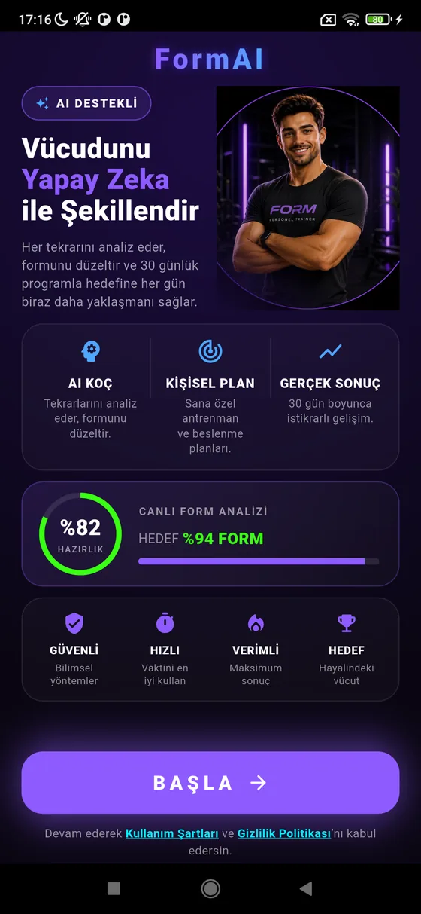

# FormAI — Final Closed Test Build Report (RC-18)

**Purpose:** The final hotfix + production artifact before the next Google Play
Closed Testing upload. One UX fix (BAŞLA above the fold), full validation, and
the signed release artifacts. No new features, no redesign.

**Branch:** `main` · **Head:** `88ec390` · **Version:** `1.0.0` (build **18**)

---

## 1. Summary

The redesigned "Başla" onboarding screen had the same problem the paywall had:
its primary CTA (**BAŞLA**) sat below the fold, so users had to scroll before
they could start. Fixed by **optimizing the layout — not redesigning it**:

- **The BAŞLA CTA + legal line are now pinned below the scroll area**, so the
  primary CTA is visible immediately — no scroll needed to start.
- **The hero is adaptive** (`IntrinsicHeight` + a `Positioned.fill` coach)
  instead of a fixed 300 px, so it never overflows on narrow phones.
- **Spacing was tightened** (title 30→26, section gaps, card paddings, the
  analysis ring 84→72) so the value-prop cards fit above the CTA on a normal
  phone with no scrolling.

Every element, the visual hierarchy, the centered logo, and the human-Form-coach
layout are preserved. All functionality (`onStart` → wizard) is unchanged.

**Green:** `flutter analyze` = 0 issues · **330 tests** (incl. a new 393×851
BAŞLA-fold regression test) · release APK + AAB build, sign, and install.

---

## 2. Başla screen validation

**Device-verified** on the Redmi (`AYXSUKIVJVPZ7HPZ`, fresh `+18` install,
data cleared for a real onboarding entry):

- ✅ **BAŞLA is immediately visible** — the whole screen (wordmark → hero →
  capability card → analysis card → trust card → **BAŞLA** → legal) fits on one
  screen. **No scrolling is required to start.**
- ✅ The redesigned hero still matches `giriş-page-redesign.png`: centered
  FormAI wordmark, `AI DESTEKLİ` badge, three-line gradient title, the human
  Form coach, the AI KOÇ · KİŞİSEL PLAN · GERÇEK SONUÇ card, the %82/%94
  analysis card, and the trust row.
- ✅ No layout regressions, no clipping, no overflow.



## 3. Responsive validation

- **Adaptive layout:** the previous fixed 300 px hero was replaced with
  `IntrinsicHeight`, so the hero sizes to its (wrap-variable) copy column at any
  width or text scale — no overflow.
- **Pinned CTA:** because the CTA lives in a fixed footer (outside the scroll
  view), it is guaranteed visible on every viewport; only the value-prop cards
  above scroll, and only on unusually short screens / very large text scales.
- **Regression test:** a widget test renders the screen at a small **393 × 851**
  6.1" viewport and asserts the BAŞLA button's bottom edge lands within the
  fold — encoding the requirement and guarding against future regressions.
- **SafeArea** is respected (the content sits inside `SafeArea`; the wordmark and
  footer carry their own padding). **Logo alignment** (centered wordmark) and
  the **human-coach hero** are unchanged.

## 4. Regression results

The only source file changed is `act_1_hook_step.dart` (the Başla screen); the
version bump is the only other change. **No regressions found.**

| Area | Result |
|------|--------|
| Onboarding | ✅ age-gate → consent → Başla → coach-intro all flow (device); 2 onboarding smoke tests + the new fold test green |
| Paywall | ✅ untouched; 9 paywall tests green (incl. its own CTA-above-fold test) |
| Premium popup | ✅ untouched (`premium_welcome_sheet.dart` unchanged) |
| AI Coach | ✅ untouched; the coach avatar (`PT_FORM.png`) renders on Başla and elsewhere |
| Workout hero images | ✅ untouched (RC-17 fix intact) |
| Launcher icon | ✅ untouched |

`flutter test` → **330 pass**. `flutter analyze` → **0 issues**.

## 5. APK information

- **File:** `build/app/outputs/flutter-apk/app-release.apk`
- **Size:** **131.1 MB** (131,135,197 bytes)
- **versionName / versionCode:** `1.0.0` / **18** (confirmed on-device via `dumpsys`)
- **Signing:** release-signed with the production upload key (`android/key.properties` present → gradle `release` signingConfig)
- **Built** clean (`flutter clean` → `pub get` → `analyze` → `test` → build)

## 6. AAB information

- **File:** `build/app/outputs/bundle/release/app-release.aab`
- **Size:** **110.0 MB** (109,977,491 bytes)
- **versionName / versionCode:** `1.0.0` / **18**
- **Obfuscation:** ✅ enabled — built with `--obfuscate --split-debug-info=build/symbols`; Dart symbol files emitted (`app.android-arm64.symbols`, `app.android-arm.symbols`, `app.android-x64.symbols`)
- **Signing:** ✅ release-signed with the upload key (`META-INF/UPLOAD.RSA` / `UPLOAD.SF` present)
- **No build errors.**

## 7. Output locations

```
APK      build/app/outputs/flutter-apk/app-release.apk         (131.1 MB)
AAB      build/app/outputs/bundle/release/app-release.aab       (110.0 MB)  ← upload this
symbols  build/symbols/app.android-{arm64,arm,x64}.symbols      (crash de-obfuscation)
```

## 8. Final verdict

The BAŞLA CTA is immediately visible on the connected Redmi with no scrolling,
the redesign is preserved, no regressions were found, and both artifacts build,
sign, and obfuscate correctly at versionCode 18.

> **This is the recommended AAB for Google Play Closed Testing:**
> `build/app/outputs/bundle/release/app-release.aab` (1.0.0 · build 18).

Confirm the versionCode has not already been used on the track before uploading.

*Single deliverable, as requested. No intermediate reports were produced.*
