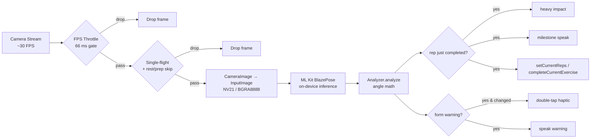
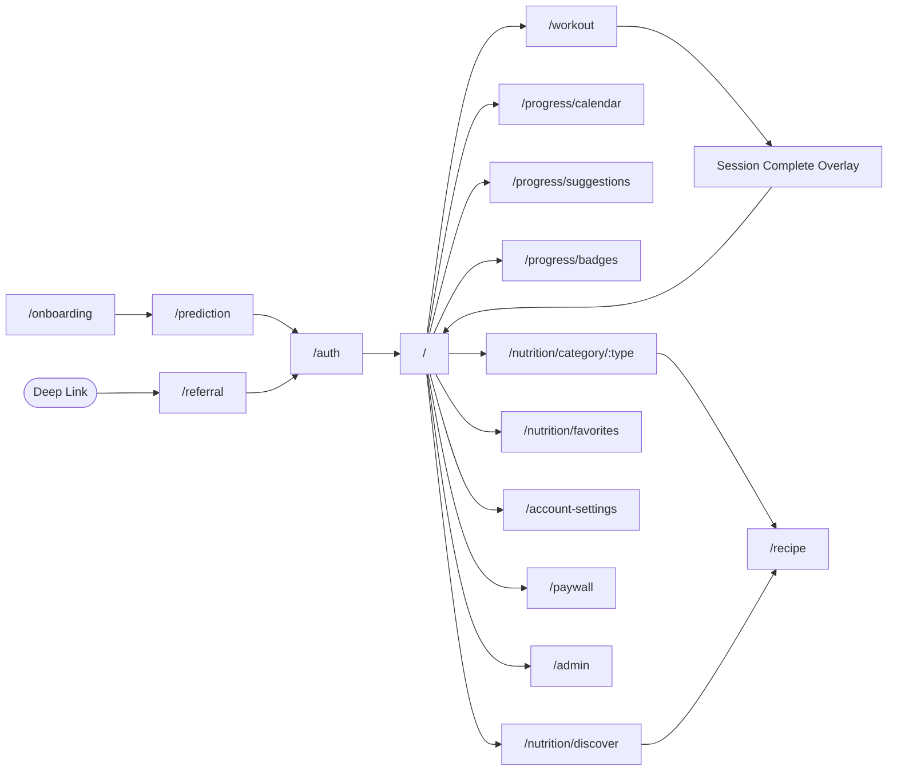

# SixPack AI / FormAI — Project Documentation

**Repository:** SixPack-AI (`name: sixpack_ai` in `pubspec.yaml`)
**Marketing Brand:** FormAI
**Marketing Tagline (TR):** "SixPack AI - 30 Günde Karın Kası" ("Six-Pack in 30 Days")
**Version:** `0.1.0+1` (`pubspec.yaml`)
**Status:** Pre-launch. 58 atomic development phases completed (Phase 39 PM post-mortem + Phases 40–58 continuation; see `ROADMAP.md` for the production-readiness audit).
**Document date:** 2026-04-28
**Document language:** English (the in-app UI strings remain Turkish — they are documented as-is).

---

## Table of Contents

1. [Project Overview](#1-project-overview)
2. [Architecture Overview](#2-architecture-overview)
3. [Full Directory Structure](#3-full-directory-structure)
4. [Key Components Breakdown](#4-key-components-breakdown)
5. [API / Backend Logic](#5-api--backend-logic)
6. [Database / Data Models](#6-database--data-models)
7. [AI / LLM / Automation Logic](#7-ai--llm--automation-logic)
8. [Frontend](#8-frontend)
9. [Configuration & Environment Variables](#9-configuration--environment-variables)
10. [Setup & Installation Guide](#10-setup--installation-guide)
11. [Running the Project](#11-running-the-project)
12. [Testing Strategy](#12-testing-strategy)
13. [Deployment & CI/CD](#13-deployment--cicd)
14. [Dependencies & Technology Stack](#14-dependencies--technology-stack)
15. [Security Considerations](#15-security-considerations)
16. [Current Limitations & Technical Debt](#16-current-limitations--technical-debt)
17. [Future Improvements & Roadmap](#17-future-improvements--roadmap)

---

## 1. Project Overview

### 1.1 What it is

**SixPack AI** (marketed as **FormAI**) is a cross-platform mobile fitness-coaching application that combines:

* A 30-day personalized workout program with on-device, **camera-based pose analysis** for live rep-counting and form correction;
* A daily **macro / calorie tracker** with a "next-best-meal" recommender;
* A **subscription paywall** (RevenueCat) gating premium content beyond a 3-day free trial;
* A Turkish-localized **content catalogue** (recipes + exercises) served from Supabase;
* Social proof / viral-loop surfaces (badge system, share-to-story, referral codes);
* Native **home-screen widgets** (iOS + Android) and **iOS Live Activities / Dynamic Island** for the active workout.

Primary market: **Turkey** (Turkish UI, Turkish-named meal database, ₺-priced subscriptions). Codebase ships an iOS + Android binary from a single Flutter project; the iOS launch is sequenced after Android per `ROADMAP.md`.

### 1.2 Status

Pre-launch. Code-complete through Phase 58 (commits `b265553`, `bb98f24`, `1dea47b`, `11560a4` are the last four landed). Production launch is gated on **PM-side** manual tasks (RevenueCat dashboard wiring, Sentry/PostHog DSNs, Supabase production SQL apply, hosted privacy/terms URLs); see `ROADMAP.md` Section 1 for the full launch-blocker checklist.

### 1.3 Who is the audience

* **End user:** Turkish-speaking fitness beginner / intermediate, age 22–35 (per `PROJECT_DOCUMENTATION1.md` Section 7.3).
* **Internal admin:** Web-only "/admin" route gated by a Supabase JWT `app_metadata.role = 'admin'` claim, used for live recipe + exercise CRUD without redeploying the mobile binary.
* **Freelance dietitian / trainer:** Drafts content through a Notion → Admin Review → Supabase pipeline documented in `docs/CONTENT_OPS.md`.

### 1.4 What this document is for

This file is intended as the **single source of truth** for the project. A reader who has never seen the codebase should be able to clone, install, run, and meaningfully extend the app using only this document plus the actual source files it points at.

---

## 2. Architecture Overview

### 2.1 Top-level architecture

```mermaid
flowchart TB
    subgraph Client["Flutter Client (iOS + Android)"]
        UI["Material 3 UI<br/>(Light / Dark / System theme)"]
        Router["GoRouter<br/>(auth + first-time + admin gates)"]
        Riverpod["Riverpod 3.x<br/>state management"]
        AI["On-device AI<br/>ML Kit BlazePose<br/>+ rule-based analyzers"]
        Local["SharedPreferences<br/>(plan cache, prefs, favs)"]
        TTS["Flutter TTS<br/>(Turkish voice coach)"]
        Widgets["Home Widget +<br/>Live Activity bridges"]
    end

    subgraph Supabase["Supabase Backend"]
        Auth["Auth<br/>(Anon, Google, Apple)"]
        Postgres["Postgres<br/>recipes / exercises /<br/>user_progress / referrals /<br/>feedback / user_metrics"]
        RLS["Row-Level Security<br/>(per-user + admin claim)"]
        Storage["Storage<br/>(exercises, recipes_images,<br/>exercises_media)"]
        RPCs["RPCs<br/>delete_user, redeem_referral"]
    end

    subgraph External["External SaaS"]
        RC["RevenueCat<br/>(subscriptions)"]
        Sentry["Sentry<br/>(crash + breadcrumbs)"]
        PostHog["PostHog<br/>(funnel + events)"]
        CDN["Optional CDN<br/>(CDN_BASE_URL)"]
    end

    subgraph Native["Native Extensions"]
        AndroidWidget["Kotlin AppWidgetProvider"]
        IOSWidget["SwiftUI Widget Bundle"]
        IOSLA["SwiftUI Live Activity"]
    end

    UI --> Router
    Router --> Riverpod
    Riverpod --> Local
    Riverpod --> Auth
    Riverpod --> Postgres
    Riverpod --> RC
    Riverpod --> Sentry
    Riverpod --> PostHog
    AI --> TTS
    AI --> Riverpod
    Postgres --> Storage
    Storage -. CDN rewrite .-> CDN
    Auth --> RPCs
    Riverpod --> Widgets
    Widgets --> AndroidWidget
    Widgets --> IOSWidget
    Widgets --> IOSLA
    Widgets -. group.app.formai.shared .-> IOSWidget
    Widgets -. SharedPreferences .-> AndroidWidget
```

### 2.2 Layered architecture inside `lib/`

The Dart codebase follows **feature-first + layered repetition**. Each feature directory carries its own `data / domain / presentation / providers / services / models` slices. There is no global `domain/` layer; cross-cutting concerns live in `lib/core/`.

```
┌────────────────────────────────────────────────────────────┐
│  Presentation (Widgets, Screens, Painters, Overlays)       │
│   • Stateless / Stateful / Consumer / ConsumerStateful     │
│   • Watches Riverpod providers, never owns business logic  │
└────────────────────────────────────────────────────────────┘
                             ▲
                             │ ref.watch / ref.read
                             ▼
┌────────────────────────────────────────────────────────────┐
│  Providers (Riverpod 3 — Provider / NotifierProvider /     │
│             AsyncNotifierProvider / FutureProvider)        │
│   • Owns derived state, caching, invalidation, listeners   │
└────────────────────────────────────────────────────────────┘
                             ▲
                             │
                             ▼
┌────────────────────────────────────────────────────────────┐
│  Domain (Pure Dart services, models, value objects)        │
│   • WorkoutGeneratorService, NutritionCalculatorService,   │
│     NextBestMealService, pose Analyzers (PoseAnalyzer …)   │
│   • No Flutter, no Supabase, no SharedPreferences          │
└────────────────────────────────────────────────────────────┘
                             ▲
                             │
                             ▼
┌────────────────────────────────────────────────────────────┐
│  Data (Repositories, network adapters)                     │
│   • WorkoutRepository, NutritionRepository                 │
│   • Owns Supabase + SharedPreferences I/O                  │
└────────────────────────────────────────────────────────────┘
                             ▲
                             │
                             ▼
┌────────────────────────────────────────────────────────────┐
│  Core / Cross-cutting                                      │
│   • Routing, theme, services (analytics, deep link,        │
│     notifications, share, live activity, widget sync,      │
│     audio TTS, app prefs), utilities                       │
└────────────────────────────────────────────────────────────┘
```

### 2.3 Cold-start sequence

`lib/main.dart` boots through a `_BootGate` widget that initializes services in this order:

1. **System chrome lock** to portrait orientation (`SystemChrome.setPreferredOrientations`).
2. **dotenv load** (`flutter_dotenv`) → reads `.env` from bundled assets. Tolerated to silently fail (the `_BootGate` retry screen surfaces if Supabase URL is missing).
3. **Sentry init** (`SentryFlutter.init`, traces sample rate `0.2`, env tagged `prod`/`dev`) with a `beforeSend` PII scrubber that nulls out `user.email`, `user.ipAddress`, and `user.data`.
4. **SharedPreferences.getInstance()**.
5. **Supabase.initialize** with `SUPABASE_URL` + `SUPABASE_ANON_KEY` (only once; flag `_supabaseInitialized` guards re-entry).
6. **PostHog setup** (`AnalyticsService.instance.init`).
7. **WidgetSyncService.instance.init()** (App Group bridge for native widgets).
8. **WorkoutLiveActivityService.instance.init()** (iOS-only ActivityKit).

RevenueCat is **deliberately deferred** to the post-onboarding / post-sign-in path (Phase 48 optimization), so a fresh launch does not block the splash on a platform-channel handshake.

After bootstrap completes, `FormAIApp` mounts a `MaterialApp.router` that uses `appRouterProvider` (a Riverpod-owned `GoRouter`) and the user-selected `themeMode`. Two listeners are activated immediately:

* `widgetSyncListenerProvider` — pushes a fresh widget snapshot whenever `workoutSessionProvider` settles.
* `smartReminderListenerProvider` — re-evaluates and re-stamps the daily notification body whenever `lastWorkoutAt` or consumed-calories state flips.
* `deepLinkServiceProvider.start()` — installs the `app_links` listeners (cold-start + warm) for `formai://...` URLs.

---

## 3. Full Directory Structure

Build / IDE / lock directories (`build/`, `.dart_tool/`, `.idea/`, `.git/`, native ephemeral) are omitted.

```
SixPack-AI/
├── analysis_options.yaml                # `package:flutter_lints/flutter.yaml`
├── pubspec.yaml                         # Flutter manifest (deps + assets)
├── pubspec.lock                         # Resolved dep tree (committed)
├── README.md                            # Single-line placeholder
├── CLAUDE.md                            # Behavioural guideline for LLM-assisted edits
├── PROJECT_DOCUMENTATION1.md            # Phase 39 (2026-04-24) PM post-mortem (Turkish)
├── PROJECT_FULL_REPORT.md               # Earlier full audit
├── ROADMAP.md                           # Pre-launch checklist (2026-04-27, Turkish)
├── .env.example                         # Template (REDACTED)
├── .env                                 # Local-only (REDACTED — gitignored)
├── .gitignore
├── exercise_miner.py                    # Python scraper for exercise demo media
├── formai-494015-f262599d264a.json      # GCP service account (gitignored)
├── sixpack_ai.iml                       # IntelliJ project metadata
├── .metadata                            # Flutter SDK metadata
├── .flutter-plugins-dependencies        # Resolved plugin metadata
│
├── docs/
│   └── CONTENT_OPS.md                   # Content-pipeline SOP (Turkish)
│
├── photos/                              # 27 onboarding/prediction WebP assets
│   ├── app_icon.png                     # Launcher icon source (PNG → flutter_launcher_icons)
│   └── *.webp                           # Onboarding hooks / physique cards / activity tiles
│
├── assets/                              # Currently empty; reserved for video assets
├── Beslenme-Photos/                     # Untracked dietitian reference shots (gitignored)
│
├── supabase/
│   └── migrations/
│       └── 001_initial_schema.sql       # user_progress + RLS
│
├── supabase_rls_policies.sql            # Phase 43 RLS for recipes / exercises / user_progress
├── supabase_exercises_migration.sql     # Phase 50A exercises table + 41-row seed
├── supabase_seed_recipes.sql            # Phase 24 recipes seed (25 rows)
├── supabase_seed_categories.sql         # Phase 28 category seed (25 rows, 5 per meal_type)
├── supabase_patch_first_5_recipes.sql   # Phase 35 instructions backfill
├── supabase_patch_missing_tags.sql      # Phase 29 tag backfill
│
├── lib/
│   ├── main.dart                        # _BootGate + FormAIApp shell
│   ├── core/                            # Cross-cutting infrastructure
│   │   ├── constants/app_constants.dart
│   │   ├── routing/app_router.dart
│   │   ├── services/                    # 9 singleton services (analytics, deep link, …)
│   │   ├── theme/                       # AppTheme, AppColors, themeModeProvider
│   │   ├── utils/                       # AngleCalculator, AppHaptics, AppLogger, …
│   │   └── widgets/                     # Shared widgets (skeleton, error, share templates)
│   └── features/
│       ├── admin/                       # Admin-only recipe + exercise CRUD UI
│       ├── auth/                        # Google + Apple + Supabase anon sign-in
│       ├── feedback/                    # In-app bug / suggestion form
│       ├── home/                        # Dashboard scaffold + 4 tabs
│       ├── monetization/                # RevenueCat paywall + churn survey
│       ├── nutrition/                   # Recipes, daily menu, AI insight, next-best meal
│       ├── onboarding/                  # 9-step wizard + prediction screen
│       ├── progress/                    # Calendar / Suggestions / Badges / Retrospective
│       ├── referral/                    # Code generator + redeemer + landing screen
│       └── workout/                     # 30-day plan + pose camera + analyzers + Live Activity
│
├── test/                                # Unit + widget tests (10 files)
│   └── features/
│       ├── home/presentation/widgets/   # today_task_card_test.dart
│       ├── monetization/presentation/   # paywall_screen_test.dart
│       ├── nutrition/                   # domain/models, domain/services, presentation
│       ├── onboarding/presentation/     # onboarding_screen_test.dart
│       ├── progress/presentation/       # calendar / badges / suggestions tests
│       └── workout/domain/services/     # workout_generator_service_test.dart
│
├── integration_test/
│   └── app_test.dart                    # Phase 44 happy-path E2E harness
│
├── android/                             # Android Flutter wrapper
│   ├── app/
│   │   ├── build.gradle.kts             # AGP 8 + Kotlin 1.9 + JDK 17 + desugaring
│   │   ├── src/main/AndroidManifest.xml # Camera, notifications, deep links, widget receiver
│   │   ├── src/main/res/                # Widget XML, drawable, styles, strings
│   │   └── src/main/kotlin/com/example/sixpack_ai/
│   │       ├── MainActivity.kt
│   │       └── widget/FormAIHomeWidgetProvider.kt   # AppWidgetProvider
│   └── …                                # Gradle wrapper (ignored), settings, build.gradle
│
├── ios/                                 # iOS Flutter wrapper
│   ├── Runner/Info.plist                # NSCameraUsageDescription, NSSupportsLiveActivities, etc.
│   ├── Runner/Assets.xcassets/          # AppIcon + LaunchImage
│   ├── Flutter/AppFrameworkInfo.plist
│   ├── Flutter/flutter_export_environment.sh
│   ├── FormAIWidget/                    # Widget Extension target
│   │   └── Info.plist                   # NSExtensionPointIdentifier = widgetkit-extension
│   ├── FormAILiveActivity/              # **UNKNOWN / NOT FOUND** — directory referenced by
│   │                                    # WorkoutLiveActivityService comments but Swift
│   │                                    # source is not present in this checkout.
│   ├── Runner.xcodeproj/                # Xcode project (only IDEWorkspaceChecks.plist tracked)
│   └── Runner.xcworkspace/
│
├── web/manifest.json                    # PWA manifest (FormAI placeholder)
├── linux/, macos/, windows/             # Default Flutter desktop scaffolding (untouched)
│
└── .github/
    └── workflows/
        ├── ci.yml                       # Format + Analyze + Test (cheap loop)
        └── flutter_ci.yml               # Format + Analyze + Build APK (debug)
```

---

## 4. Key Components Breakdown

### 4.1 `lib/core/`

#### 4.1.1 Routing — `core/routing/app_router.dart`

* Single Riverpod-owned `GoRouter` (`appRouterProvider`).
* **Redirect chain (in order of priority):**
  1. `/referral` — always passes (deep-link survives both gates).
  2. `prefs.isFirstTime == true` → forces `/onboarding`.
  3. `Supabase.currentUser == null` → forces `/auth`.
  4. After sign-in, `/onboarding` redirects to `/prediction`.
  5. `/auth` redirects to `/paywall` for already-registered users (anonymous users may pass through to `/auth` to upgrade their account).
  6. `/admin` redirects to `/` for any user without `appMetadata['role'] == 'admin'`.
* **Auto-refresh:** `authRefreshListenableProvider` is wired into `GoRouter.refreshListenable` so navigation re-evaluates on every Supabase `AuthState` event.
* **Error builder:** custom `_DeepLinkSplashScreen` (neon "FormAI" wordmark on black) to avoid the default `Page Not Found` flash during cold-start deep-link races.
* **Routes:**

| Path | Name | Purpose |
| --- | --- | --- |
| `/` | dashboard | 4-tab BottomNav scaffold |
| `/onboarding` | onboarding | 9-step wizard |
| `/auth` | auth | Sign-in screen |
| `/workout` | workout | Pose camera screen |
| `/workout/today` | workoutToday | Alias redirect to `/workout` (widget / Live-Activity deep-link) |
| `/paywall` | paywall | RevenueCat paywall |
| `/prediction` | prediction | Post-wizard "AI prediction" screen |
| `/plan-detail` | planDetail | 30-day plan view (and ad-hoc plan view via `extra`) |
| `/account-settings` | accountSettings | Account + KVKK / data-deletion |
| `/recipe` | recipeDetail | Recipe detail (takes `Recipe` as `extra`) |
| `/nutrition/category/:type` | nutritionCategory | Category-filtered recipe grid |
| `/nutrition/discover` | nutritionDiscover | Full discovery grid |
| `/nutrition/favorites` | nutritionFavorites | Saved recipes (Phase 56 Lite) |
| `/progress/calendar` | progressCalendar | 30-day calendar view |
| `/progress/suggestions` | progressSuggestions | AI Coach suggestion list |
| `/progress/badges` | progressBadges | Badge gallery |
| `/admin` | admin | Admin recipe + exercise CRUD |
| `/referral` | referralLanding | Deep-link landing for referral codes |

#### 4.1.2 Theming — `core/theme/`

* `AppColors` — single canonical palette (neon `#8E5BFF`, neon-accent `#4DA6FF`, cyber-cyan `#00F0FF`, neon green `#39FF14`, success / danger / orange / amber / pink, macro tints, dark + light surfaces). Phase 53 added a dedicated light-mode set with a WCAG-AA-compliant `orangeOnLight = #B45309`.
* `AppTheme.dark()` and `AppTheme.light()` builders — both seed off `AppColors.neon` via `ColorScheme.fromSeed`. Each builder layers a custom `SnackBarThemeData` (floating, neon hairline border, 14-pt rounded corners) and a custom `BottomNavigationBarThemeData`.
* `themeModeProvider` (`NotifierProvider<ThemeMode>`) — persists the user's selection (`system`/`light`/`dark`) to SharedPreferences as a string token (key `sixpack.theme_mode`). Idempotent guard: `if (state == mode) return;` to avoid infinite rebuilds.

#### 4.1.3 Services — `core/services/`

| Service | File | Responsibility |
| --- | --- | --- |
| `AppPreferences` | `app_preferences.dart` | Façade over SharedPreferences. Holds `isFirstTime`, `goal`, `userMetrics`, `nutritionStreak`, `nutritionPrefsCompleted`, `dailyReminderEnabled`, `maxStreak` (Phase 52 high-water mark), `lastWorkoutAt`. Drops the cached 30-day plan when `targetPhysique` changes. |
| `AnalyticsService` | `analytics_service.dart` | Typed PostHog event façade. Singleton. ATT (`requestAttIfNeeded`) gated on iOS. ~14 typed events: onboarding step, paywall view, purchase, recipe added, share initiated/completed, referral surfaced/redeemed, shopping list exported, feedback submitted, churn reason. |
| `AppLogger` | `core/utils/app_logger.dart` | `info / warning / error` façade. `info`/`warning` add a Sentry breadcrumb; `error` captures the exception in addition. |
| `AudioFeedback` | `core/utils/audio_feedback.dart` | `flutter_tts` wrapper. Probes available voices, falls back from `tr-TR` to `en-US`. iOS audio category set to `.playback` with `.allowBluetooth + mixWithOthers + defaultToSpeaker`. 3-second per-phrase de-dupe in `speak()`. |
| `NotificationService` | `notification_service.dart` | `flutter_local_notifications` wrapper. Sets timezone to `Europe/Istanbul`. `scheduleDailyReminder(time, condition)` re-stamps the daily ping with one of three variant pools (`SmartReminderCondition.noWorkout / workoutNoFood / bothDone`). `scheduleStreakWarning()` queues a 48-h one-shot. Uses `AndroidScheduleMode.exactAllowWhileIdle` + `USE_EXACT_ALARM` permission. |
| `SmartReminderListener` | `smart_reminder_scheduler.dart` | Phase 58. Riverpod listener that re-evaluates the daily-reminder body whenever `workoutSessionProvider` or `consumedMacrosProvider` flips. Hard-coded fire-time 19:00 (`TimeOfDay(hour: 19, minute: 0)`). |
| `DeepLinkService` | `deep_link_service.dart` | `app_links` integration. Cold-start (`getInitialLink`) + warm (`uriLinkStream`). Normalises `formai://r/<CODE>` (custom scheme — DartUri parses host=`r`, path=`<CODE>`) and `https://formai.app/r/<CODE>` into a unified `[host, ...pathSegments]` list, then dispatches: `r/<CODE>` → `/referral?code=<CODE>`, `workout/today` → `/workout`. |
| `ShareService` | `share_service.dart` | Off-screen `Overlay` + `RepaintBoundary` rendering of share PNGs (1080×1920 story or 1080×1080 square) using `ShareProgressTemplate` / `ShareBadgeTemplate`. Plain-text `shareReferralCode` + `shareRecipe` (Phase 57 includes `Malzemeler` + `Yapılışı` blocks). Fires `share_initiated` + `share_completed` analytics. |
| `WidgetSyncService` | `widget_sync_service.dart` | `home_widget` bridge. Writes `today_task_name`, `today_task_subtitle`, `progress_percent`, `streak_count`, `completed_days`, `total_days`, `deep_link`, `updated_at_ms` into the platform store keyed by App Group `group.app.formai.shared`. Push triggered from `widgetSyncListenerProvider`. |
| `WorkoutLiveActivityService` | `live_activity_service.dart` | iOS-only `live_activities` plugin wrapper. `startWorkout / updateWorkout / endWorkout`. Payload keys mirror a `WorkoutAttributes.ContentState` Codable in `ios/FormAILiveActivity/WorkoutAttributes.swift` (file referenced by comments — see `UNKNOWN / NOT FOUND` note below). |

> **UNKNOWN / NOT FOUND** — the Swift sources for the iOS Widget Extension and Live Activity (`ios/FormAIWidget/AppWidget.swift`, `ios/FormAILiveActivity/WorkoutAttributes.swift`) are referenced in source comments but no `.swift` files are present in this checkout. Either the Xcode project tracks them outside the repository, or they were never committed. The Dart bridge (`WidgetSyncService`, `WorkoutLiveActivityService`) is fully implemented; the Android counterpart (`FormAIHomeWidgetProvider.kt`) is committed.

#### 4.1.4 Constants — `core/constants/app_constants.dart`

```dart
class AppConstants {
  static const int programLength = 30;            // 30-day program length
  static const int kcalPerCompletedDay = 250;     // Estimated kcal burn per program day
  static const int freeDayLimit = 3;              // Free trial days before the paywall engages
}
```

#### 4.1.5 Utilities

* `AngleCalculator.between(a, b, c)` — interior angle at vertex `b` of rays `b→a` and `b→c`, in degrees clamped to `[0, 180]`. Uses `atan2` and absolute-value normalisation.
* `MediaUrl.resolve(raw, bucket)` — single resolver for storage URLs. CDN base (`CDN_BASE_URL`) takes precedence over Supabase Storage public path. Rewrites pre-existing absolute Supabase URLs onto the CDN if configured. Bare filenames are composed as `<base>/<bucket>/<filename>`. External URLs (e.g. Unsplash) pass through unchanged.
* `StorageFilenameSanitizer` (`String.sanitizeFileName`) — Phase 51 hotfix. Transliterates Turkish characters (`ı→i`, `ğ→g`, `ş→s`, `ç→c`, …), lowercases, replaces non-ASCII non-alphanum with `_`, trims, optionally caps to `maxLength = 80`.
* `LegalUrls` — `https://formai.app/terms`, `https://formai.app/privacy`, `support@formai.app`. `openLegalUrl` and `openSupportMail` both wrap `url_launcher` and log/swallow failures.
* `AppHaptics` — semantic façade over `HapticFeedback`. `primaryCta()` = medium, `secondaryTap()` = light, `success()` = selection click, `milestone()` = heavy, `warningDoubleTap()` = two light taps 80 ms apart.
* `defaultMuscularPhotoUrl` / `defaultLeanPhotoUrl` — Unsplash fallback hero images.

### 4.2 `lib/features/`

#### 4.2.1 `auth/` — Sign-in and identity

* `AuthController` (regular class, held by `authControllerProvider`) — `signInWithGoogle()`, `signInWithApple()`, `signOut()`, `deleteAccount()`.
* Apple flow uses an SHA-256-hashed nonce per Supabase requirements (`crypto` package). Google flow reads `GOOGLE_WEB_CLIENT_ID` (and optionally `GOOGLE_IOS_CLIENT_ID`) from `.env`.
* `deleteAccount()` calls a Supabase RPC `delete_user` (`SECURITY DEFINER` server-side; SQL not yet committed — see ROADMAP §1.5.1) and unconditionally clears `SharedPreferences` after.
* `_invalidateUserScopedProviders()` — invalidates `workoutSessionProvider`, `subscriptionProvider`, `appPreferencesProvider`, `wizardProvider`, `recipesProvider`, `dailyMenuProvider`, `celebratedBadgesProvider` so the next user does not inherit the previous account's cache.
* `currentUserProvider` — derived from `Supabase.instance.client.auth.currentUser`.
* `isAdminProvider` — true iff `user.appMetadata['role'] == 'admin'`. `app_metadata` (not `user_metadata`) is intentional because the former is server-mintable only, whereas the latter is client-mutable and would let a malicious client self-promote.
* `authRefreshListenableProvider` — `ChangeNotifier` that fires on every `auth.onAuthStateChange`.
* Outcome enums: `SocialAuthOutcome { success, cancelled, error }`, `DeleteAccountOutcome { success, error }`.

#### 4.2.2 `onboarding/` — 9-step wizard

* `WizardState` (immutable value object). 11 fields: `gender`, `age`, `heightCm`, `weightKg`, `currentPhysique`, `targetPhysique`, `activityLevel`, `dietPreference`, `allergies`, `mealFrequency`, `prepTime`. Defaults exposed as module-level `kDefault*` constants.
* Enums: `Gender { female, male, other }`, `Physique { slim, normal, heavy }`, `GoalPhysique { tone, bulk, sixpack }`, `ActivityLevel { sedentary, light, active }`.
* `WizardController extends Notifier<WizardState>` — typed setters per field. Held by `wizardProvider`.
* `OnboardingScreen` (`ConsumerStatefulWidget`) — 9-page horizontal `PageView` (no swipe physics; only programmatic nav). Pages: welcome, coach intro, gender, age, body metrics, current physique, target physique, activity, illusion. Phase 46 lifted the four nutrition questions (diet, allergies, meal frequency, prep time) into a deferred `NutritionOnboardingSheet` shown the first time the Beslenme tab opens, dropping the wizard from 13 → 9 steps.
* On finish (`_finish()`): persist `WizardState.toJson()` into `AppPreferences.userMetrics`, mark first-time = false, kick off (deferred) `configureRevenueCat()`, anonymously sign in to Supabase, request iOS ATT, navigate to `/prediction`.

#### 4.2.3 `monetization/` — RevenueCat + paywall + churn survey

* `kProEntitlementId = 'FormAI Pro'` (case-sensitive, space included).
* `_kDevProOverrideKey = 'sixpack.monetization.dev_pro_override'` — debug-only SharedPreferences flag flipped by the paywall's "Sandbox" button (Phase 47 verified gated by `kDebugMode`).
* `SubscriptionState`: `isPro`, `isDeveloperOverride`, `offerings`.
* `SubscriptionNotifier extends AsyncNotifier<SubscriptionState>` — `_load()` reads `Purchases.getCustomerInfo()` + `Purchases.getOfferings()`. On any failure (offline, missing keys), returns a neutral state so the paywall falls back to hardcoded prices.
* `purchase(Package)` returns `PurchaseOutcome { success, cancelled, notEntitled, error }`. `restore()` returns `RestoreOutcome { restored, nothingToRestore, error }`.
* `isProProvider` — derived. `snapshot.isDeveloperOverride || snapshot.isPro`.
* `revenueCatApiKey()` — picks `REVENUECAT_IOS_KEY` or `REVENUECAT_ANDROID_KEY` from `.env` based on `Platform.is*`. Returns `null` for missing/empty keys.
* `configureRevenueCat()` — idempotent guarded by `_revenueCatConfigured`. Logs `setLogLevel` (debug in dev, error in release) and calls `Purchases.configure`. Called from `OnboardingScreen._finish()`, `AuthController.signIn{Google,Apple}()`.
* `ChurnSurveySheet` (Phase 56 Lite) — surfaced before `Manage Subscriptions` deep-link. Reasons exposed as stable English tokens (`too_expensive`, `reached_goal`, `not_using`, `other`), shipped to PostHog via `logChurnReason(reason: …)`.

> **Naming caveat:** `.env.example` lists `REVENUECAT_APPLE_KEY` / `REVENUECAT_GOOGLE_KEY` — **stale**. The code reads `REVENUECAT_IOS_KEY` / `REVENUECAT_ANDROID_KEY`. ROADMAP §6.1 flags the discrepancy.

#### 4.2.4 `nutrition/` — Recipes, daily plan, recommender

Files:

* `data/nutrition_repository.dart` — `NutritionRepository.fetchRecipes(from, limit)`. Phase 48 cursor-paginated read of `public.recipes` ordered by `id`, default page size 20.
* `domain/models/recipe.dart` — `Recipe` value object (id, title, mealType, calories, protein, carbs, fat, prepTimeMinutes, imageUrl, instructions, tags, ingredients). `Recipe.fromJson` is tolerant: numeric fields accept `int`/`num`/`String`, image URL routes through `MediaUrl.resolve`, tags+ingredients use `_parseTags` which handles both `List<dynamic>` and Postgres array literal `String` (`{Vegan, Sıkılaşma}` / `{"Yüksek Protein","Hacim"}`).
* `domain/models/macro_target.dart` — `MacroTarget(calories, protein, carbs, fat)` immutable value type with `==`/`hashCode`.
* `domain/models/daily_meal_slot.dart` — `enum DailyMealSlot { breakfast, lunch, dinner, snack }` + tolerant `parseDailyMealSlot(String)`.
* `domain/models/planned_meal.dart` — `PlannedMeal(id, recipe, slot, status)` with `enum MealStatus { planned, completed, skipped }`.
* `domain/services/nutrition_calculator_service.dart` — `calculateDailyMacros(weight, height, age, gender, activityLevel, goal)`. Mifflin-St Jeor BMR → activity multiplier → goal calorie delta → macro split. **Detailed in §7.2.**
* `domain/services/next_best_meal_service.dart` — `suggestNextMeal(recipes, remaining)`. Three-tier priority recommender. **Detailed in §7.3.**
* `providers/nutrition_provider.dart` — `nutritionCalculatorProvider`, `filterChipsProvider` (NotifierProvider<String?>), `nutritionRepositoryProvider`, `recipesProvider` (paginated AsyncNotifier), `macroTargetProvider`, `consumedMacrosProvider`, `remainingMacrosProvider`, `nextBestMealServiceProvider`, `nextBestMealProvider`, `dailyScoreProvider` (gamification 0-100 — calories ±10% +40, protein ≥90% +30, carbs ±15% +15, fat ±15% +15), `nutritionStreakProvider`.
* `providers/daily_menu_provider.dart` — `DailyMenuNotifier extends AsyncNotifier<List<PlannedMeal>>`. Reads `mealFrequency` from persisted `AppPreferences.userMetrics`. `markAsCompleted/Skipped/resetMeal/addRecipeToPlan`. `_generateInitialPlan` rotates through pool offsets per `mealType`.
* `providers/favorite_recipes_provider.dart` — `Set<String>` of recipe IDs. SharedPreferences key `sixpack.favorite_recipe_ids`. Local-first with optional Supabase upsert.
* Presentation: `nutrition_tab.dart` (1590 lines) — main Beslenme tab including `_ExpandedDecisionPanel` hero (calorie ring, macro bars, AI insight banner, next-best-meal card). `recipe_detail_screen.dart`, `category_recipes_screen.dart`, `discover_recipes_screen.dart`, `favorites_screen.dart`. Widgets: `ai_insight_banner.dart`, `meal_plan_timeline.dart`, `next_best_meal_card.dart`, `nutrition_onboarding_sheet.dart`, `recipe_tags.dart`.

#### 4.2.5 `workout/` — 30-day program, pose camera, analyzers

Files (data/domain/models layer):

* `models/exercise_model.dart` — `Exercise` immutable. Fields include: `id` (slug), `name` (Turkish), `type` (`ExerciseType.repBased | timeBased`), `category` (`ExerciseCategory.core/chest/legs/back/arms/shoulders/fullBody`), `difficulty` (string `beginner/intermediate/advanced`), `targetMuscle` (string `core/upper_body/lower_body/full_body/cardio`), `isCardio`, `targetReps?`, `targetDurationInSeconds?`, `videoUrl?`, `sets`, `restDurationInSeconds`, `description` (long form, spoken on prep), `shortTip` (4-6 word pill).
* `models/workout_day_model.dart` — `WorkoutDay(dayNumber, exercises, isCompleted, title)`. `isRestDay = exercises.isEmpty`.
* `models/workout_plan_model.dart` — `WorkoutPlan(id, title, category, level, durationMinutes, exercises, image)`. Used for ad-hoc "Sınırlarını Zorla" / region-tagged dashboard cards.
* `data/workout_repository.dart` (807 lines) — owns:
  * `_planKey = sixpack.user_custom_plan_v3` (cached 30-day plan).
  * `getAllExercises()` — fetches `public.exercises` ordered by `slug`. Per-instance memoised future. Failure → empty list (the generator falls back to "30 rest days").
  * `loadOrGenerateProgram(generator, userGoal, fitnessLevel)` — cache-or-generate, overlays completion flags from local + remote sources.
  * `markDayCompleted(dayNumber)` — local set update + 48-h streak warning + Supabase upsert into `public.user_progress` (with retry queue `_pendingSync`).
  * `_pushLimitsTemplates` (4 cards) and `_regionalTemplates` (~24 cards) — slug-keyed plan templates resolved against the live exercise catalogue.
* `domain/services/workout_generator_service.dart` — rule-based 30-day plan generator. **Detailed in §7.1.**

Files (services/analyzers layer):

* `services/pose_detector_service.dart` — thin wrapper around `google_mlkit_pose_detection`. `PoseDetectionMode.stream`.
* `services/pose_analyzer.dart` — abstract base: `CrunchResult analyze(Pose); void reset();`.
* `services/analyzer_factory.dart` — switch on `Exercise.id` returns the right concrete analyzer (24 mappings + `SilentHoldAnalyzer` default).
* `services/crunch_analyzer.dart` — state machine for crunches/sit-ups; tracks shoulder-hip-knee torso angle and ear-shoulder-hip neck angle.
* `services/core_analyzers.dart` — `LegRaiseAnalyzer`, `RussianTwistAnalyzer`, `MountainClimberAnalyzer`, `BicycleCrunchAnalyzer`, `FlutterKickAnalyzer`, `PlankAnalyzer` (time-based posture warning), `SilentHoldAnalyzer` (encouragement-only).
* `services/chest_analyzers.dart` — `PushUpAnalyzer`, `BenchPressAnalyzer extends PushUpAnalyzer` (tighter ROM thresholds), `ChestFlyAnalyzer`.
* `services/back_legs_analyzers.dart` — `SquatAnalyzer`, `PullUpAnalyzer`.
* `services/shoulders_arms_cardio_analyzers.dart` — `BicepsCurlAnalyzer`, `ShoulderPressAnalyzer`, `LateralRaiseAnalyzer`, `JumpingJackAnalyzer`, `BurpeeAnalyzer`.

Files (provider layer):

* `providers/workout_provider.dart` — `workoutRepositoryProvider`, `workoutPlansProvider` (FutureProvider), `pushLimitsPlansProvider` (FutureProvider), `WorkoutSessionState` (full session model), `WorkoutSessionNotifier extends AsyncNotifier<WorkoutSessionState>` with `startDay`, `initializeWorkout`, `completeCurrentExercise`, `skipRest`, `previousExercise`, `resetProgress`, `setCurrentReps`, `acknowledgeSessionComplete`. Internal `_enterRest` / `_startPrep` drive the rest + 3-second HAZIRLAN! prep countdowns.

Files (presentation layer):

* `workout_camera_screen.dart` (1405 lines) — the most complex screen. ML disclosure dialog → camera permission → `availableCameras().firstWhere(front)` → `ResolutionPreset.medium` → `enableAudio: false` → `imageFormatGroup: nv21 (Android) / bgra8888 (iOS)` → `startImageStream(_onCameraImage)`. Single-flight gate (`_isProcessingFrame`) + 66 ms FPS throttle (~15 FPS effective on top of 30 FPS native) + hard skip during rest/prep. Voice coach speaks "Sıradaki hareket: <name>. <description>" / pacing hints / "Boynunu düz tut!" / etc. Uses wakelock_plus to keep screen awake.
* `pose_painter.dart` — `CustomPainter` that draws skeleton landmarks on the camera preview.
* `plan_detail_screen.dart` — 30-day grid view + ad-hoc plan view (decided by `extra: WorkoutPlan?`).
* Widgets: `exercise_guide_player.dart` (video preview during prep), `preparation_overlay.dart` (HAZIRLAN! 3-2-1), `rest_overlay.dart`, `session_complete_overlay.dart`, `workout_back_button.dart`, `workout_control_panel.dart`.

#### 4.2.6 `home/` — Dashboard scaffold

* `dashboard_screen.dart` — 4-tab scaffold with `BottomNavigationBar`, `RouteAware` to detect when the dashboard becomes the topmost route again (so badge celebration dialogs only fire when the user is actually looking at the Gelişim tab).
* Tabs: `antrenman_tab.dart` (Workout), `nutrition_tab.dart`, `gelisim_tab.dart` (Progress), `profile_tab.dart`.
* Widgets: `today_task_card.dart`, `weekly_goal_card.dart`, `challenge_hero_card.dart`, `push_limits_strip.dart`, `stat_tile.dart`.
* `account_settings_screen.dart` — profile edit, theme toggle, daily-reminder switch, delete-account row, support mail row.

#### 4.2.7 `progress/`

* `presentation/calendar_screen.dart` — 30-day calendar.
* `presentation/suggestions_screen.dart` — AI Coach suggestions list (rule-based off `workoutSessionProvider` + macro state).
* `presentation/badges_screen.dart` — full badge gallery (12 badges).
* `presentation/widgets/weekly_retrospective_card.dart` — Sunday recap card.
* `presentation/widgets/badge_unlock_dialog.dart` — celebration dialog (with share button).
* `providers/badge_unlocks_provider.dart` — `kBadgeCatalog` (12 entries: `first_step`, `disciplined`, `first_week`, `steady`, `halfway`, `calorie_hunter`, `hiit_master`, `core_master`, `strength_stone`, `nutrition_hero`, `thirty_day_champion`, `form_legend`), `unlockedBadgesProvider` (derives the unlocked set from live signals), `celebratedBadgesProvider` (in-memory `Set<String>?` of already-celebrated IDs), `routeObserverProvider` (shared `RouteObserver<PageRoute<dynamic>>`).

#### 4.2.8 `referral/`

* `services/referral_service.dart` — 6-character code from a 32-char alphabet (`23456789ABCDEFGHJKMNPQRSTUVWXYZ` — excludes look-alike `0/O/1/I/L`). `getOrCreateCode()` reads SharedPreferences (`sixpack.referral_code`) → falls back to remote (`user_metrics.referral_code` upsert). `redeem(referrerCode)` calls Supabase RPC `redeem_referral` and stores the redeemed code locally (`sixpack.referral_redeemed_code`). Error mapping: `ReferralErrorCode { invalidFormat, invalidCode, selfReferral, alreadyRedeemed, notAuthenticated, network, unknown }`.
* `providers/referral_provider.dart` — `referralServiceProvider`, `referralCodeProvider` (FutureProvider, fires `referralCodeSurfaced` once per session).
* `presentation/referral_landing_screen.dart` — incoming-referral landing screen.

#### 4.2.9 `feedback/`

* `services/feedback_service.dart` — Supabase first (insert into `public.feedback`), mailto fallback. Subjects: `bug | suggestion | question`. Each submission stamps `app_version` + `platform` + `os_version` from `package_info_plus` + `dart:io.Platform`. Returns `FeedbackTransport { supabase, mailto }`.
* `presentation/feedback_sheet.dart` — bottom sheet with subject dropdown + message field.

#### 4.2.10 `admin/`

* `presentation/admin_dashboard_screen.dart` — responsive shell. `width >= 600` → permanent left sidebar; `width < 600` → AppBar + Drawer. Sections: `dashboard / recipes / exercises`. Defensive double-check: `ref.watch(isAdminProvider) ? render : redirect to /`.
* `presentation/widgets/admin_recipe_form.dart` — full recipe CRUD with WebP image picker (`image_picker`), `XFile.readAsBytes`, Supabase Storage upload via `sanitizeFileName`, `recipes` insert/update.
* `presentation/widgets/admin_exercise_form.dart` — same pattern for exercises (slug + name + type + category + difficulty + target_muscles[] + sets + reps/duration + rest + cardio flag + instructions + short_tip + video URL + thumbnail URL).

---

## 5. API / Backend Logic

The "backend" in this project is **Supabase** — there is no bespoke server. The Flutter client interacts with Supabase via the `supabase_flutter` SDK in three modes: (a) direct table reads/writes, (b) RPCs, (c) Storage uploads.

### 5.1 Direct table operations

| Operation | Caller | Table | Comment |
| --- | --- | --- | --- |
| `select().order('id').range(from, to)` | `NutritionRepository.fetchRecipes` | `public.recipes` | Paginated recipe catalogue |
| `select().order('slug')` | `WorkoutRepository._fetchExercises` | `public.exercises` | Full exercise catalogue (cached per repository instance) |
| `upsert({user_id, day_number, is_completed, completed_at})` | `WorkoutRepository._upsertCompleted` | `public.user_progress` | `onConflict: 'user_id,day_number'` |
| `select('day_number,is_completed').eq('user_id',uid).eq('is_completed',true)` | `WorkoutRepository._completedDays` | `public.user_progress` | Remote completion ledger |
| `insert({user_id, subject, message, app_version, platform, os_version})` | `FeedbackService._trySupabase` | `public.feedback` | RLS-guarded `with check (auth.uid() = user_id)` |
| `upsert({user_id, referral_code})` / `select('referral_code').eq('user_id',uid).maybeSingle()` | `ReferralService._persistOnSupabase` / `_fetchRemoteCode` | `public.user_metrics` | Read-write of the user's stable code; expected schema (Phase 54) |
| Recipe / exercise CRUD | `admin_recipe_form.dart` / `admin_exercise_form.dart` | `public.recipes` / `public.exercises` | Gated by RLS admin claim |

### 5.2 RPC operations

| RPC | Caller | Status |
| --- | --- | --- |
| `delete_user()` | `AuthController.deleteAccount` | **NOT yet committed to migrations** — code path exists, SQL spelled out in `ROADMAP.md` §1.5.1. Must run with `SECURITY DEFINER` server-side. |
| `redeem_referral(referrer_code text)` | `ReferralService.redeem` | **NOT yet committed to migrations** — Phase 54. SQL in `ROADMAP.md` §1.5.2. Validates: not authenticated → `unauthenticated`, not found → `invalid_code`, self → `self_referral`, duplicate → unique-violation rejection. |

### 5.3 Storage buckets

* `exercises` — exercise videos (`.mp4`) and thumbnails. Public read.
* `exercises_media` — admin-uploaded images attached to exercises. Public read.
* `recipes_images` — admin-uploaded recipe hero images. Public read.

URL composition:

```
<CDN_BASE_URL>/<bucket>/<filename>                                        (when CDN configured)
<SUPABASE_URL>/storage/v1/object/public/<bucket>/<filename>               (default)
```

Both routes are unified through `MediaUrl.resolve`. A pre-existing absolute Supabase URL is rewritten onto the CDN if the prefix matches; arbitrary external URLs (Unsplash, etc.) pass through unchanged.

### 5.4 Auth flows

* **Anonymous** — `Supabase.instance.client.auth.signInAnonymously()` is invoked at the end of onboarding so the user can preview their `/prediction` screen without a sign-up form.
* **Google** — `google_sign_in` (v7) → `signIn.authenticate(scopeHint: ['email', 'profile'])` → `account.authentication.idToken` → `Supabase.client.auth.signInWithIdToken(provider: OAuthProvider.google, idToken: ..., accessToken: ?)`.
* **Apple** — `sign_in_with_apple.SignInWithApple.getAppleIDCredential(scopes: [email, fullName], nonce: sha256(rawNonce))` → `Supabase.client.auth.signInWithIdToken(provider: OAuthProvider.apple, idToken: ..., nonce: rawNonce)`.

### 5.5 Telemetry endpoints

* **PostHog** — events listed in `core/services/analytics_service.dart`. Project keyed by `POSTHOG_API_KEY`, host `POSTHOG_HOST` (defaults to `https://app.posthog.com`).
* **Sentry** — initialised with `SENTRY_DSN`. `tracesSampleRate: 0.2`. PII scrubber on `beforeSend` (clears `user.email`, `user.ipAddress`, `user.data`).

---

## 6. Database / Data Models

All schemas live in **Supabase** (Postgres 15). The repository tracks SQL migrations in two places:

* `supabase/migrations/001_initial_schema.sql` — the **only** versioned migration committed.
* Root-level patch SQL files (`supabase_*.sql`) — Phase 24+ idempotent scripts to be applied through Supabase Studio's SQL Editor.

### 6.1 ER Diagram (logical)

```mermaid
erDiagram
    users ||--o{ user_progress : owns
    users ||--o| user_metrics : has
    users ||--o{ feedback : files
    users ||--o{ referrals_referrer : invites
    users ||--o{ referrals_invitee : redeems

    users {
        uuid id PK
        text email
        jsonb app_metadata
        jsonb raw_user_meta_data
    }

    user_progress {
        uuid id PK
        uuid user_id FK
        integer day_number
        boolean is_completed
        timestamptz completed_at
        timestamptz created_at
        timestamptz updated_at
    }

    recipes {
        bigint id PK
        text title UK
        text meal_type
        int calories
        int protein
        int carbs
        int fat
        int prep_time_minutes
        text image_url
        text instructions
        text_array tags
        text_array ingredients
    }

    exercises {
        uuid id PK
        text slug UK
        text name
        text type
        text category
        text difficulty
        text_array target_muscles
        int target_reps
        int target_duration_in_seconds
        int sets
        int rest_duration_in_seconds
        bool is_cardio
        text instructions
        text short_tip
        text video_url
        text thumbnail_url
        timestamptz created_at
        timestamptz updated_at
    }

    feedback {
        uuid id PK
        uuid user_id FK
        text subject
        text message
        text app_version
        text platform
        text os_version
        timestamptz created_at
    }

    user_metrics {
        uuid user_id PK_FK
        text gender
        int age
        int height_cm
        int weight_kg
        text current_physique
        text target_physique
        text activity_level
        text diet_preference
        text allergies
        text meal_frequency
        text prep_time
        text referral_code
        timestamptz created_at
        timestamptz updated_at
    }

    referrals {
        uuid id PK
        uuid referrer_id FK
        uuid invitee_id FK
        text referrer_code
        timestamptz redeemed_at
    }
```

### 6.2 `public.user_progress` (committed migration)

```sql
create table if not exists public.user_progress (
  id           uuid primary key default gen_random_uuid(),
  user_id      uuid not null references auth.users (id) on delete cascade,
  day_number   integer not null check (day_number between 1 and 30),
  is_completed boolean not null default false,
  completed_at timestamptz,
  created_at   timestamptz not null default now(),
  updated_at   timestamptz not null default now(),
  unique (user_id, day_number)
);
create index user_progress_user_idx on public.user_progress (user_id);
-- updated_at trigger via public.set_updated_at()
```

RLS (`supabase_rls_policies.sql` Section 3): `auth.uid() = user_id` predicate on every CRUD verb, scoped `TO authenticated` (excluding `anon`).

### 6.3 `public.recipes`

DDL is **implicit** — created by the early seed runs. Columns observed in code + seeds:

| Column | Type | Notes |
| --- | --- | --- |
| `id` | bigint / uuid | Primary key (treated opaquely as `String` by `Recipe.fromJson`) |
| `title` | text | UNIQUE constraint (`recipes_title_unique`) added by seed preamble |
| `meal_type` | text | One of `breakfast` / `lunch` / `dinner` / `snack` / `main` / `dessert` |
| `calories` | int | kcal per serving |
| `protein` | int | g per serving |
| `carbs` | int | g per serving |
| `fat` | int | g per serving |
| `prep_time_minutes` | int | Whole minutes |
| `image_url` | text | External URL OR Supabase Storage filename |
| `instructions` | text | Multi-line, dollar-quoted (`$$…$$`) |
| `tags` | text[] | DEFAULT `'{}'`. Phase 24+ tags: `Yüksek Protein`, `Düşük Kalori`, `Hacim`, `Sıkılaşma`, `Vegan` |
| `ingredients` | text[] | Phase 57 column |

RLS: world-readable (`recipes_public_read TO authenticated, anon`); INSERT/UPDATE/DELETE gated on `auth.jwt() -> 'app_metadata' ->> 'role' = 'admin'`.

### 6.4 `public.exercises`

DDL committed via `supabase_exercises_migration.sql`:

```sql
CREATE TABLE IF NOT EXISTS public.exercises (
  id                          uuid PRIMARY KEY DEFAULT gen_random_uuid(),
  slug                        text UNIQUE NOT NULL,
  name                        text NOT NULL,
  type                        text NOT NULL CHECK (type IN ('repBased','timeBased')),
  category                    text NOT NULL CHECK (category IN
                              ('core','chest','legs','back','arms','shoulders','fullBody')),
  difficulty                  text NOT NULL CHECK (difficulty IN
                              ('beginner','intermediate','advanced')),
  target_muscles              text[] NOT NULL DEFAULT '{}',
  target_reps                 int,
  target_duration_in_seconds  int,
  sets                        int NOT NULL DEFAULT 3,
  rest_duration_in_seconds    int NOT NULL DEFAULT 30,
  is_cardio                   boolean NOT NULL DEFAULT false,
  instructions                text NOT NULL DEFAULT '',
  short_tip                   text NOT NULL DEFAULT '',
  video_url                   text,
  thumbnail_url               text,
  created_at                  timestamptz NOT NULL DEFAULT now(),
  updated_at                  timestamptz NOT NULL DEFAULT now()
);
```

Indexes: `slug`, `category`, `difficulty`, GIN on `target_muscles`. `updated_at` trigger via `public.exercises_touch_updated_at()`. Seed: 9 core + 6 chest + 6 legs + 5 back + 5 shoulders + 5 arms + 5 cardio/fullBody = **41 rows**, all with `ON CONFLICT (slug) DO NOTHING`.

RLS: identical contract to `recipes` — public read, admin-only writes.

### 6.5 `public.feedback` (Phase 56 Lite — SQL not yet committed)

```sql
create table if not exists public.feedback (
  id          uuid primary key default gen_random_uuid(),
  user_id     uuid not null references auth.users(id) on delete cascade,
  subject     text not null check (subject in ('bug','suggestion','question')),
  message     text not null check (length(message) between 1 and 4000),
  app_version text,
  platform    text,
  os_version  text,
  created_at  timestamptz not null default now()
);
-- Indexes on user_id and subject; RLS: authenticated insert/select where user_id = auth.uid().
```

(Full DDL ready-to-apply lives in `ROADMAP.md` §1.5.3.)

### 6.6 `public.referrals` + `public.user_metrics` (Phase 54 — partly applied)

* `public.user_metrics` — schema spelled out (commented) in `supabase_rls_policies.sql` Section 4. Currently **wizard data lives in SharedPreferences only**; the table is defensive scaffolding for future multi-device sync.
* `public.referrals` — DDL in `ROADMAP.md` §1.5.2. Tracks `referrer_id`, `invitee_id`, `referrer_code`, `redeemed_at` with `UNIQUE (invitee_id)` to prevent multi-redeem. `redeem_referral(referrer_code text)` RPC validates self/duplicate/unknown.

### 6.7 Seed content

* `supabase_seed_recipes.sql` — Phase 24, 25 recipes across 5 tag buckets (Yüksek Protein, Düşük Kalori, Hacim, Sıkılaşma, Vegan).
* `supabase_seed_categories.sql` — Phase 28, 25 recipes across 5 meal-type buckets (5 Breakfast, 5 Lunch, 5 Dinner, 5 Snack, 5 Dessert).
* `supabase_patch_first_5_recipes.sql` — Phase 35 instructions uplift in `MALZEMELER:` / `HAZIRLANIŞI:` format.
* `supabase_patch_missing_tags.sql` — Phase 29 backfill rules: `calories ≥ 500` → `Hacim`; `calories ≤ 400` → `Düşük Kalori`; `protein ≥ 30` → `Yüksek Protein`; `calories ≤ 500 AND protein ≥ 20 AND fat ≤ 15` → `Sıkılaşma`.

### 6.8 SharedPreferences keys (client-side persistence)

| Key | Type | Owner | Purpose |
| --- | --- | --- | --- |
| `sixpack.is_first_time` | bool | AppPreferences | Onboarding gate |
| `sixpack.goal` | String | AppPreferences | Cached `targetPhysique` |
| `sixpack.user_metrics` | JSON String | AppPreferences | Full wizard payload |
| `sixpack.user_custom_plan_v3` | JSON String | WorkoutRepository | Cached 30-day plan |
| `sixpack.completed_days` | List\<String\> (int IDs) | WorkoutRepository | Local completion ledger |
| `sixpack.pending_sync_days` | List\<String\> | WorkoutRepository | Retry queue for failed Supabase upserts |
| `sixpack.nutrition_streak` | int | AppPreferences | Days streak (currently driven by client-only logic) |
| `sixpack.nutrition_prefs_completed` | bool | AppPreferences | NutritionOnboardingSheet one-shot flag |
| `sixpack.daily_reminder_enabled` | bool | AppPreferences | Daily-ping toggle source of truth |
| `sixpack.max_streak` | int | AppPreferences | All-time-high streak (Phase 52 watermark) |
| `sixpack.last_workout_at` | ISO-8601 String | AppPreferences | Used by smart reminder scheduler |
| `sixpack.theme_mode` | String (`system/light/dark`) | themeModeProvider | Persisted theme choice |
| `sixpack.favorite_recipe_ids` | List\<String\> | FavoriteRecipesNotifier | Set of favourite recipe IDs |
| `sixpack.referral_code` | String | ReferralService | Stable 6-char code |
| `sixpack.referral_redeemed_code` | String | ReferralService | Code the user redeemed |
| `sixpack.monetization.dev_pro_override` | bool | SubscriptionNotifier | Debug-only Sandbox button |

---

## 7. AI / LLM / Automation Logic

> **Important framing:** despite the marketing name "**FormAI**" / "AI fitness coach", **this project does NOT use any LLM (Anthropic / OpenAI / Gemini / etc.)**. There are no system prompts, no tool calls, no agent loops, no embeddings, no fine-tuned models. Every "AI" surface in the app is one of:
>
> 1. **A rule-based geometric pose analyzer** computing joint angles from on-device ML Kit BlazePose landmarks.
> 2. **A deterministic rule-based generator / recommender** (workout plan, next-best-meal, smart reminder).
> 3. **A small content-generation script** (`exercise_miner.py`) that scrapes a public dataset for demo media — not an inference call.
>
> The only externally-trained model touched is **Google's ML Kit pose-detection model**, which runs **fully on-device** through `google_mlkit_pose_detection` v0.14.1.

### 7.1 Workout Generator Service

**File:** `lib/features/workout/domain/services/workout_generator_service.dart`

#### 7.1.1 Public contract

```dart
List<WorkoutDay> generate30DayPlan({
  required String userGoal,         // 'sixpack' / 'bulk' / 'tone' / aliases
  required String fitnessLevel,     // 'beginner' / 'intermediate' / 'advanced' / aliases
  required List<Exercise> pool,     // From WorkoutRepository.getAllExercises()
});
```

The service is a **pure function** — same inputs ⇒ same output. No randomness, no clock dependency.

#### 7.1.2 Pipeline (deterministic, 30-day)

1. **Empty-pool guard** — return `30 × WorkoutDay(exercises: [], title: 'Dinlenme Günü')` if `pool.isEmpty`. Prevents an offline first-launch from producing an empty dashboard.
2. **Goal normalisation** (`_normaliseGoal`) — accepts `sixpack / six_pack / six pack / core` → `_Goal.sixpack`; `bulk / hacim / hypertrophy / muscle` → `_Goal.bulk`; `tone / sıkılaşmak / sikilasmak / toning / cut` → `_Goal.tone`; default `_Goal.sixpack`.
3. **Level normalisation** (`_normaliseLevel`) — accepts wizard's `ActivityLevel` enum (`sedentary / light / active`) and Phase 16 strings (`beginner / intermediate / advanced` and `ileri / orta`).
4. **Goal-filter (round-robin)** (`_filterByGoal`):
   * `_Goal.sixpack` → round-robin merge of `core`, `cardio`, `full_body` muscle pools.
   * `_Goal.bulk` → round-robin merge of `upper_body`, `lower_body`, `full_body`.
   * `_Goal.tone` → round-robin merge of `cardio`, `full_body`, `core`, `lower_body`.
5. **Per-day loop (1-30):**
   * Every 4th day (`day % 4 == 0`) ⇒ rest day (empty exercises, title "Dinlenme Günü"). That covers days 4, 8, 12, 16, 20, 24, 28.
   * Otherwise compute `weekIndex = (dayNumber - 1) ~/ 7`.
   * `_filterByLevel` — beginners are denied advanced exercises until `weekIndex >= 2` (i.e. day 15+). intermediate / advanced see the full level-filtered pool.
   * `_dailyExerciseCount(dayNumber)` returns `5 + (dayNumber % 3)` — yielding a 5/6/7-exercise pattern that repeats deterministically.
   * Round-robin pick from `dailyPool[(cursor + i) % dailyPool.length]`, advancing `cursor` by `exerciseCount` per day.
   * **Progressive overload** — every day's exercises pass through `_applyOverload(base, math.pow(1.2, weekIndex))`. `targetReps` and `targetDurationInSeconds` are multiplied and rounded (clamped to a floor of 1). Multipliers: week 1 = 1.0, week 2 = 1.2, week 3 = 1.44, week 4 = 1.728, week 5 = 2.0736.

#### 7.1.3 Caching

`WorkoutRepository._planKey = 'sixpack.user_custom_plan_v3'`. The plan JSON (full `List<WorkoutDay>.toJson()`) is persisted to SharedPreferences after first generation. Cache invalidation:

* `AppPreferences.saveUserMetrics(...)` drops the cache when `targetPhysique` changes.
* `WorkoutRepository.resetProgress()` drops the cache + completion sets.
* Empty pool → cache write skipped so the next launch retries the catalogue fetch.

### 7.2 Nutrition Calculator Service

**File:** `lib/features/nutrition/domain/services/nutrition_calculator_service.dart`

#### 7.2.1 Pipeline

```
BMR (Mifflin-St Jeor) → TDEE (× activity factor) → Calories ± goal delta → Macro grams
```

#### 7.2.2 BMR — Mifflin-St Jeor (1990)

```
Men:   BMR = (10 × kg) + (6.25 × cm) − (5 × age) + 5
Women: BMR = (10 × kg) + (6.25 × cm) − (5 × age) − 161
Other: BMR = (10 × kg) + (6.25 × cm) − (5 × age) − 78    (midpoint correction)
```

Sex correction code:

```dart
double _sexCorrection(String gender) {
  switch (gender.trim().toLowerCase()) {
    case 'male': case 'm': case 'erkek': return 5;
    case 'female': case 'f': case 'kadın': case 'kadin': return -161;
    default: return -78; // Other / unspecified.
  }
}
```

#### 7.2.3 Activity multiplier

| Token (canonical + accepted aliases) | Multiplier |
| --- | --- |
| `sedentary` / `hareketsiz` | 1.20 |
| `light` / `lightly_active` / `hafif` | 1.375 |
| `active` / `moderate` / `moderately_active` / `aktif` | 1.55 |
| `very_active` / `athlete` / `çok_aktif` / `cok_aktif` | 1.725 |
| Unknown | 1.20 (conservative default) |

#### 7.2.4 Goal modifier

| Goal alias group | Calorie delta | Macro split (P / F / C) |
| --- | --- | --- |
| `six_pack`, `sixpack`, `cut`, `lose`, `lose_weight` | **−500 kcal** | 40 / 30 / 30 |
| `bulk`, `hacim`, `hypertrophy`, `gain`, `gain_muscle` | **+500 kcal** | 30 / 20 / 50 |
| Default (tone / recomp) | **−200 kcal** | 35 / 30 / 35 |

#### 7.2.5 Macro construction

```
safeCalories = max(calories, 1200)              # 1200 kcal/day floor (safety)
proteinGrams = (safeCalories × pRatio) / 4      # Atwater factor
carbGrams    = (safeCalories × cRatio) / 4
fatGrams     = (safeCalories × fRatio) / 9
```

All four values rounded to whole numbers in the final `MacroTarget`.

### 7.3 Next-Best-Meal Recommender

**File:** `lib/features/nutrition/domain/services/next_best_meal_service.dart`

#### 7.3.1 Public contract

```dart
NextMealRecommendation? suggestNextMeal({
  required List<Recipe> recipes,
  required MacroTarget remaining,
});
```

Returns `null` only when the catalogue is empty.

#### 7.3.2 Three-tier priority (in order)

**Tier 1 — Protein focus.** Fires when `remaining.protein > 30 g`. Picks the highest-protein non-dessert recipe with `recipe.protein > 25 g`. Sort: `protein` descending. Reason copy: `"Protein açığını kapatmak için önerildi."` ("Recommended to close your protein gap.")

**Tier 2 — Low-calorie finish.** Fires when `remaining.calories < 400 kcal`. Picks the lowest-calorie recipe with `calories < 300 kcal`. Sort: `calories` ascending. Reason: `"Kalan kalorine uygun hafif bir seçenek."` ("A light option for your remaining calories.")

**Tier 3 — Balance (Euclidean fallback).** Always fires if T1/T2 do not match. Minimises:

```
distance² = (recipe.protein − remaining.protein)²
          + (recipe.carbs   − remaining.carbs  )²
          + (recipe.fat     − remaining.fat    )²
```

(no `sqrt` — order is preserved). Reason: `"Kalan makrolarına en iyi eşleşme."` ("Best match for your remaining macros.")

#### 7.3.3 Output shape

```dart
class NextMealRecommendation {
  final Recipe recipe;
  final String reason;          // Turkish copy from the tier
  final String impactString;    // e.g. "+25g Protein | +520 kcal"
}
```

### 7.4 Smart Reminder Scheduler

**Files:** `lib/core/services/notification_service.dart` + `lib/core/services/smart_reminder_scheduler.dart`

#### 7.4.1 Three conditions (Phase 58)

```dart
enum SmartReminderCondition {
  noWorkout,        // user hasn't worked out today
  workoutNoFood,    // workout done, no nutrition logged
  bothDone,         // workout + nutrition logged
}
```

Each condition has its own variant pool (≥2 strings each). The variant for the next firing is picked uniformly at random per scheduling call.

#### 7.4.2 Variants

* `noWorkout` (3 variants):
  * `Antrenman Vakti! 💪` / `Hedeflerinden uzaklaşma. Günün egzersizi seni bekliyor, hemen başla!`
  * `Bugünün antrenmanı seni bekliyor! 💪` / `Sadece 10–15 dakika. Seriyi koruyalım, bir adım daha at.`
  * `Bir hedefin var, unutma 🎯` / `Bugün antrenmanı geçersen yarın iki gün geride kalırsın.`
* `workoutNoFood` (2 variants):
  * `Yakıt Gerekli! 🥩` / `Harika bir antrenman çıkardın. Şimdi toparlanma vakti, bugünün öğünlerini kaydet!`
  * `Toparlanma zamanı 🥗` / `Antrenmanı bitirdin — şimdi öğünlerini ekle ve bugünü tamamla.`
* `bothDone` (3 variants):
  * `Günü fethettin! 🏆` / `Bugün disiplinden kopmadın. Şimdi bol su iç ve dinlenmeye geç.`
  * `Mükemmel bir gün 💧` / `Antrenman ✅ Beslenme ✅ — kalan tek şey su ve kaliteli uyku.`
  * `Devam et! ⚡` / `Bugün hedeflerini tutturdun. Yarın da aynı disiplinle devam.`

#### 7.4.3 Streak warning (Phase 52)

A separate `_streakWarningId = 1002` notification queued **48 hours** after every successful workout completion (`WorkoutRepository.markDayCompleted` ↦ `NotificationService.scheduleStreakWarning`). Two variants:

* `Seriyi kaybetmek üzeresin! ⚡` / `48 saat oldu. 10 dakikalık bir oturum momentumu kurtarır.`
* `Geri dönüş zamanı 🔁` / `Serini bozmadan bugün bir set yap; yarın daha da kolaylaşır.`

#### 7.4.4 Listener wiring

`smartReminderListenerProvider` watches:

1. `workoutSessionProvider` (full state).
2. `consumedMacrosProvider.calories` (selector — only re-evaluates when calories change).

On any change it computes `(workoutDone, nutritionLogged)` from `AppPreferences.isWorkoutDoneToday` + `consumedMacrosProvider.calories > 0`, picks the matching `SmartReminderCondition`, and re-stamps `NotificationService.scheduleDailyReminder(TimeOfDay(19, 0), condition)`.

### 7.5 Pose Analysis Engine (on-device CV)

This is the largest body of "AI" code in the project — ~1500 lines across `crunch_analyzer.dart`, `core_analyzers.dart`, `chest_analyzers.dart`, `back_legs_analyzers.dart`, `shoulders_arms_cardio_analyzers.dart`. Every analyzer implements:

```dart
abstract class PoseAnalyzer {
  CrunchResult analyze(Pose pose);
  void reset();
}
```

(The result class is named `CrunchResult` for legacy reasons — its `torsoAngle` / `neckAngle` fields are debug-only and may be `null` for non-crunch flows.)

#### 7.5.1 Common building blocks

* `AngleCalculator.between(a, b, c)` — interior angle at `b`. Returns degrees in `[0, 180]`.
* `_pickHigher(pose, leftType, rightType)` — picks the landmark with higher `likelihood`, tolerating partial visibility.
* `_armAngle / _kneeAngle / _shoulderArmAngle` — helpers that bail when any input landmark has likelihood < 0.4.

#### 7.5.2 Per-exercise analyzers

| Exercise IDs (slugs) | Analyzer | Mechanic | Thresholds |
| --- | --- | --- | --- |
| `crunch`, `situp` | `CrunchAnalyzer` | Shoulder-hip-knee torso angle. DOWN if > 140°, UP if < 90°. Neck warning at ear-shoulder-hip < 120° during UP (15-s debounce). Pacing: too-fast < 1.5 s ⇒ "Biraz yavaşla, kaslarını hisset.", too-slow > 4.5 s ⇒ "Hadi, pes etme!" (7-s cooldown). | `downThreshold=140`, `upThreshold=90`, `neckWarning=120`, `minRepInterval=1200ms` |
| `plank` | `PlankAnalyzer` | Time-based. Posture warning when shoulder-hip-ankle line angle < 155°. 8-s cooldown. | `minStraightAngle=155` |
| `leg_raise`, `hanging_leg_raise` | `LegRaiseAnalyzer` | Shoulder-hip-ankle hip angle. DOWN > 150°, UP < 110°. | `minRepInterval=1100ms` |
| `russian_twist` | `RussianTwistAnalyzer` | Horizontal shoulder-mid vs hip-mid offset. Side commit at offset > 18% of shoulder width. Counts a rep on each L↔R side flip. | `twistFraction=0.18`, `minRepInterval=600ms` |
| `mountain_climber` | `MountainClimberAnalyzer` | Knee-to-shoulder distance. Active side = shorter than 55% torso length. Counts on hand-off between sides. | `activeFraction=0.55`, `minRepInterval=350ms` |
| `bicycle_crunch` | `BicycleCrunchAnalyzer` | Cross-pair distance LE↔RK vs RE↔LK against shoulder width. Side flip = rep. | `activeFraction=0.5`, `minRepInterval=500ms` |
| `flutter_kick` | `FlutterKickAnalyzer` | Y-coordinate delta between left and right ankle. Side flip = rep. | `minDelta=12px`, `minRepInterval=350ms` |
| `push_up`, `incline_push_up`, `decline_push_up`, `chest_dip`, `pike_push_up`, `triceps_dip`, `close_grip_push_up` | `PushUpAnalyzer` | Shoulder-elbow-wrist angle. DOWN < 95°, UP > 160°. | `minRepInterval=900ms` |
| `bench_press` | `BenchPressAnalyzer extends PushUpAnalyzer` | Same mechanic, tighter ROM. | `down=100°, up=155°, minRepInterval=1100ms` |
| `chest_fly` | `ChestFlyAnalyzer` | Wrist-gap / shoulder-width ratio. OPEN > 1.4, CLOSED < 0.5. | `openFraction=1.4`, `closeFraction=0.5` |
| `squat`, `lunge`, `bulgarian_split_squat`, `leg_press`, `jump_squat` | `SquatAnalyzer` | Hip-knee-ankle angle. DOWN < 100°, UP > 165°. | `minRepInterval=1100ms` |
| `wall_sit`, `calf_raise`, `superman`, `high_knees`, `skipping_rope` | `SilentHoldAnalyzer` | No-op rep counting. Rotates 3 encouragement lines on an 18-s cadence. | — |
| `pull_up`, `chin_up`, `lat_pulldown`, `barbell_row` | `PullUpAnalyzer` | Inverted PushUp. DOWN > 150°, UP < 80°. | `minRepInterval=1200ms` |
| `shoulder_press`, `arnold_press` | `ShoulderPressAnalyzer` | Wrist-vs-shoulder vertical delta (in shoulder-widths). UP > 0.7 × shoulderWidth, DOWN < 0.1. Partial-rep nudge: max delta < 55% of UP threshold ⇒ "Kolları tam yukarı uzat!" | — |
| `lateral_raise`, `front_raise` | `LateralRaiseAnalyzer` | Elbow-shoulder-hip angle. UP > 75°, DOWN < 25°. | `minRepInterval=900ms` |
| `biceps_curl`, `hammer_curl`, `triceps_pushdown` | `BicepsCurlAnalyzer` | Same as PullUp but tighter. UP < 50°, DOWN > 150°. | `minRepInterval=900ms` |
| `burpee` | `BurpeeAnalyzer` | Three-phase state machine on shoulder-Y self-calibrated against running min/max. STANDING→DOWN edge fires `contextualCue: "Şimdi aşağı in ve plank pozisyonu al."` (8-s cooldown). DOWN→STANDING = rep. | `minRange=60px`, `minRepInterval=1500ms` |
| `jumping_jack` | `JumpingJackAnalyzer` | Ankle spread > 1.4 × shoulder width AND wrists above shoulders by > 0.6 × shoulder width = OPEN. CLOSED ↔ OPEN cycle = rep. | `minRepInterval=500ms` |

#### 7.5.3 Camera pipeline (`workout_camera_screen.dart`)



Frame pipeline guards (Phase 48):

* `_isProcessingFrame` single-flight gate — drops new frames while previous BlazePose inference is still running.
* `_minFrameIntervalMs = 66` (~15 FPS effective on a 30-FPS camera) — halves CPU/GPU load with no observable accuracy loss.
* Hard skip during `session.isResting || session.isPreparing` — saves the most expensive call (BlazePose inference at ~25-50 ms on mid-range Androids) for every rest/prep frame.
* Rotation handling: iOS uses `sensorOrientation`. Android compensates with `(sensorOrientation ± deviceRotation) % 360` (sign depends on lens direction).
* Format: NV21 on Android, BGRA8888 on iOS. Frames are dropped if format / planes are missing.

#### 7.5.4 Voice coach (TTS)

Triggered from `workout_camera_screen.dart` listeners:

* **Session complete:** "Antrenman tamamlandı! Harika bir iş çıkardın." + heavy haptic.
* **Rest entry:** "Harika! Şimdi <rest_seconds> saniye dinlenme."
* **Prep entry:** "Sıradaki hareket: <name>. <description>" — ("Başlayın!" fallback if description is empty).
* **Pacing milestones (per rep):**
  * `reps == target − 2` ⇒ "Son iki tekrar, sık dişini!"
  * `reps == target / 2` (when target ≥ 4) ⇒ "Yarıladın! Aynen böyle devam et."
* **Analyzer-emitted lines:** `formWarning` (e.g. "Boynunu düz tut!", "Kalçanı düz tut, plank pozisyonunu koru!", "Kolları tam yukarı uzat!"), `pacingFeedback`, `contextualCue` (Burpee: "Şimdi aşağı in ve plank pozisyonu al.").

### 7.6 Badge unlock engine

**File:** `lib/features/progress/providers/badge_unlocks_provider.dart`

12 badges, each with a stable English ID and Turkish label/subtitle/emoji:

| ID | Predicate |
| --- | --- |
| `first_step` | `completedDays >= 1` |
| `disciplined` | `streak >= 3` |
| `first_week` | `completedDays >= 7` |
| `steady` | `streak >= 7` |
| `halfway` | `completedDays >= 14` |
| `calorie_hunter` | `weeklyKcal >= 1500` (`weeklyKcal = completedDays × 250`) |
| `hiit_master` | `cardioDaysCompleted >= 5` (a day counts when ≥ half its exercises are `isCardio`) |
| `core_master` | `coreDaysCompleted >= 5` (any exercise with `targetMuscle == 'core'`) |
| `strength_stone` | `strengthDaysCompleted >= 5` (any exercise with `targetMuscle == 'upper_body' OR 'lower_body'`) |
| `nutrition_hero` | `nutritionStreak >= 7` |
| `thirty_day_champion` | `completedDays >= 30` |
| `form_legend` | `completedDays >= 30 AND nutritionStreak >= 30` |

The dashboard subscribes to `unlockedBadgesProvider` and diffs against `celebratedBadgesProvider` to surface a celebration dialog only on the FIRST unlock per app session.

### 7.7 Why no LLM?

Per `PROJECT_DOCUMENTATION1.md` Section 1 and `pubspec.yaml`, the project does not include `langchain`, `anthropic`, `openai`, or any LLM SDK. The "AI" experience is delivered through:

* **Branding** ("FormAI", "AI Koç").
* **On-device computer vision** (ML Kit BlazePose, fully local, no PII leaves the device).
* **Deterministic algorithmic personalisation** (Mifflin-St Jeor + activity factor + goal delta + macro split + 30-day rule-based generator + Euclidean meal recommender + smart-reminder state machine).

This is a **deliberate** product choice — the privacy story (no frame ever leaves the device, no account-level training data leaves the EU/TR Supabase region) is mentioned across multiple commit messages and `ROADMAP.md` Section 1.3 ("camera frames are NOT sent to a server").

---

## 8. Frontend

### 8.1 Framework

* **Flutter ≥ 3.22**, **Dart ≥ 3.4**.
* **Material 3** (`useMaterial3: true`).
* Routing: `go_router` 17.2.1.
* State: `flutter_riverpod` 3.3.1 (with `Notifier`, `AsyncNotifier`, `Provider`, `FutureProvider`).
* Single locale (Turkish UI strings hard-coded in widget literals; the app is ready for `l10n` but does not ship arb files yet).

### 8.2 Screen inventory



### 8.3 Notable widgets

* `_BootGate` (root, in `main.dart`) — splashes a neon "FormAI" wordmark (cyan `#00F0FF` shadow), hides Supabase / Sentry / PostHog init from the user, surfaces a retry screen on init failure.
* `DashboardScreen` — 4-tab BottomNav ("Antrenman / Beslenme / Gelişim / Profil"). RouteAware-subscribes to the route observer to gate badge celebration dialogs.
* `_ExpandedDecisionPanel` (inside `nutrition_tab.dart`) — Beslenme tab hero. Calorie ring with traffic-light color, macro bars (P/C/F), AI insight banner ("X kcal fazla aldın — yürüyüş yap"), Next Best Meal card.
* `WorkoutCameraScreen` — full-bleed camera preview with skeleton overlay, exercise progress bar, set/rep counter, rest overlay, prep overlay (HAZIRLAN! 3-2-1), and a session-complete trophy overlay.
* `PaywallScreen` — RevenueCat-backed paywall with a hard-coded fallback when offerings are empty. Restore Purchases button. Sandbox button gated on `kDebugMode`.
* `ReferralLandingScreen` — reads `?code=<CODE>` from the URI and renders an invite preview before requiring sign-in.
* `AdminDashboardScreen` — responsive (sidebar at ≥600 dp width, drawer below). Three sections: dashboard / recipes / exercises.
* `BadgeUnlockDialog` — celebration dialog with a "Paylaş" button that hands the badge into `ShareService.shareBadge`.

### 8.4 Off-screen rendering for shares

`ShareService` mounts `ShareProgressTemplate` / `ShareBadgeTemplate` inside a positioned-off-screen `Overlay` (`Positioned(left: -size.width - 200, top: -size.height - 200)`), wraps a `RepaintBoundary` with `pixelRatio: 1.0`, and waits for two `endOfFrame` callbacks (with a 32 ms safety sleep) before encoding the boundary to PNG bytes via `RenderRepaintBoundary.toImage().toByteData(format: ImageByteFormat.png)`. The bytes are persisted to a temp file (`getTemporaryDirectory()`) and handed to `share_plus`'s `SharePlus.instance.share(ShareParams(files: [XFile], text, subject))`.

### 8.5 Asset bundle

`pubspec.yaml` only bundles two asset roots:

```yaml
flutter:
  uses-material-design: true
  assets:
    - .env
    - "photos/"
```

The `photos/` directory holds 27 onboarding/prediction WebP images named in Turkish (e.g. `ilkkarşılamaanaekranarkaplanı.webp`, `vücutseçimikiloluhacimli.webp`). `ROADMAP.md` §2.1 flags non-ASCII characters and embedded spaces as a CI risk — `errorBuilder` fallbacks (gradient ColoredBox) ensure the app never crashes even if a single asset fails to bundle.

`assets/` is currently empty (Phase 35 removed `docs/<region>/` after switching the Bölgeler strip to Unsplash).

---

## 9. Configuration & Environment Variables

### 9.1 `.env` schema

```
SUPABASE_URL=                  # e.g. https://xtvqhnjamwvmfcsahzxv.supabase.co  <REDACTED>
SUPABASE_ANON_KEY=             # JWT public anon key (safe to bundle in APK)    <REDACTED>
GOOGLE_WEB_CLIENT_ID=          # OAuth web client id used by Supabase Google provider
GOOGLE_IOS_CLIENT_ID=          # Optional; only read on Platform.isIOS

# Phase 51 — CDN routing
CDN_BASE_URL=                  # Optional; empty falls back to raw Supabase Storage public URLs

# Phase 42 — Observability
SENTRY_DSN=                    # Sentry project DSN; empty = SDK initialises but no events sent
POSTHOG_API_KEY=               # PostHog Project API Key; empty = AnalyticsService is disabled
POSTHOG_HOST=                  # Default https://app.posthog.com (use https://eu.posthog.com for EU)

# Phase 45 — RevenueCat (named differently in code vs example file — see warning below)
REVENUECAT_IOS_KEY=            # Reads from this key on Platform.isIOS
REVENUECAT_ANDROID_KEY=        # Reads from this key on Platform.isAndroid
```

> ⚠️ The committed `.env.example` lists `REVENUECAT_APPLE_KEY` / `REVENUECAT_GOOGLE_KEY`. The **code reads** `REVENUECAT_IOS_KEY` / `REVENUECAT_ANDROID_KEY` (`monetization_provider.dart:184-186`). Use the code's spelling. ROADMAP §3.8 has a 3-minute fix queued.

### 9.2 GCP service-account JSON

`formai-494015-f262599d264a.json` (kept gitignored under the `formai-*.json` rule in `.gitignore`). Used outside the Flutter app for Play-Console / Firebase admin tasks. Should never ship to clients.

### 9.3 Build-time configuration

* **Android:** `android/app/build.gradle.kts`
  * `applicationId = "com.emredogan.formai"` (Phase 59B — production package id).
  * `compileSdk` / `minSdk` / `targetSdk` / `versionCode` / `versionName` — flow from `flutter` Gradle DSL.
  * `JavaVersion.VERSION_17` (Java + Kotlin).
  * `multiDexEnabled = true`.
  * `coreLibraryDesugaring("com.android.tools:desugar_jdk_libs:2.1.4")` — required by `flutter_local_notifications`'s `java.time` use on `minSdk < 26`.
* **iOS:** `ios/Runner/Info.plist`
  * `NSCameraUsageDescription` (Turkish): "Antrenman sırasında formunu analiz etmek için kamerana ihtiyacımız var."
  * `NSMicrophoneUsageDescription`: "Antrenman seanslarını kaydederken mikrofon erişimi kullanılabilir."
  * `NSUserTrackingUsageDescription`: "Sana daha iyi ve kişiselleştirilmiş bir deneyim sunabilmemiz için izin ver."
  * `CFBundleURLTypes` declares `formai` custom scheme (URL Name `app.formai.deeplink`).
  * `NSSupportsLiveActivities = true` and `NSSupportsLiveActivitiesFrequentUpdates = true` (Phase 55).
  * Privacy manifest `ios/Runner/PrivacyInfo.xcprivacy` mentioned in ROADMAP §1.3 — **UNKNOWN / NOT FOUND** in this checkout.
* **Android manifest:** `android/app/src/main/AndroidManifest.xml`
  * Permissions: `CAMERA`, `INTERNET`, `POST_NOTIFICATIONS`, `RECEIVE_BOOT_COMPLETED`, `USE_EXACT_ALARM`, `SCHEDULE_EXACT_ALARM`.
  * Intent filters on `MainActivity`: deep-link `formai://*` (BROWSABLE+DEFAULT), App Links `https://formai.app/*` with `autoVerify="false"` (until `assetlinks.json` is hosted).
  * Receivers: `FormAIHomeWidgetProvider` (widget) + `flutterlocalnotifications.ScheduledNotificationReceiver` + `ScheduledNotificationBootReceiver` (with `BOOT_COMPLETED` / `MY_PACKAGE_REPLACED` / `QUICKBOOT_POWERON` actions).
  * `<queries>` declares TTS engine intent so `flutter_tts.getLanguages` works on Android 11+.

### 9.4 App-level configuration constants

| Constant | Value | File |
| --- | --- | --- |
| `kProEntitlementId` | `'FormAI Pro'` (case-sensitive, space included) | `monetization_provider.dart:16` |
| `programLength` | `30` | `app_constants.dart:16` |
| `kcalPerCompletedDay` | `250` | `app_constants.dart:24` |
| `freeDayLimit` | `3` | `app_constants.dart:30` |
| `_appGroupId` (iOS / native) | `'group.app.formai.shared'` | `widget_sync_service.dart`, `live_activity_service.dart` |
| `_androidProvider` | `'com.emredogan.formai.widget.FormAIHomeWidgetProvider'` | `widget_sync_service.dart` |
| `weeklyOverloadMultiplier` | `1.2` | `workout_generator_service.dart:37` |
| `proteinGapThreshold` | `30` g | `next_best_meal_service.dart:51` |
| `proteinRecipeThreshold` | `25` g | `next_best_meal_service.dart:52` |
| `lowCalorieGapThreshold` | `400` kcal | `next_best_meal_service.dart:53` |
| `lowCalorieRecipeThreshold` | `300` kcal | `next_best_meal_service.dart:54` |

### 9.5 `analysis_options.yaml`

```yaml
include: package:flutter_lints/flutter.yaml
```

Single-line; uses the canonical Flutter lint set without overrides.

---

## 10. Setup & Installation Guide

### 10.1 Prerequisites

| Tool | Version | Notes |
| --- | --- | --- |
| Flutter SDK | ≥ 3.22 (stable) | `flutter --version` should report 3.22+ |
| Dart SDK | ≥ 3.4 | Bundled with Flutter |
| Android Studio / Xcode | Latest | Xcode required for iOS Live Activity / Widget targets |
| Java | JDK 17 | Required by AGP 8 |
| Git | Any modern | |
| Supabase project | A free-tier project | URL + anon key needed for `.env` |

### 10.2 Clone

```bash
git clone <repository-url> SixPack-AI
cd SixPack-AI
```

### 10.3 Install Flutter dependencies

```bash
flutter pub get
```

### 10.4 Provision Supabase

1. Create a Supabase project (region nearest your users).
2. **In SQL Editor, run in order:**
   1. `supabase/migrations/001_initial_schema.sql` — `user_progress` table + base RLS.
   2. `supabase_exercises_migration.sql` — `exercises` table + 41-row seed.
   3. `supabase_seed_recipes.sql` — Phase 24 recipes (25 rows).
   4. `supabase_seed_categories.sql` — Phase 28 recipes (25 rows, 5 per meal_type).
   5. `supabase_patch_first_5_recipes.sql` — instructions uplift (Phase 35).
   6. `supabase_patch_missing_tags.sql` — tag backfill (Phase 29).
   7. `supabase_rls_policies.sql` — full RLS for `recipes`, `exercises`, `user_progress`.
   8. **Manual (uncommitted):** the SQL bodies for `delete_user`, `redeem_referral`, `feedback` table — copy them from `ROADMAP.md` §1.5.1 / §1.5.2 / §1.5.3.
3. **Auth:** enable the Google + Apple providers. Add the Web client ID + Web client secret to the Google provider's settings.
4. **Storage:** create three public buckets — `exercises`, `exercises_media`, `recipes_images`.
5. **Auth → Anonymous Sign-In:** enable so the post-onboarding flow works.

### 10.5 Configure environment

Create `.env` at project root (this file is **gitignored** by `.gitignore` line 1):

```env
SUPABASE_URL="https://<your-project>.supabase.co"
SUPABASE_ANON_KEY="<your-anon-jwt>"
GOOGLE_WEB_CLIENT_ID="<your-web-client-id>"
GOOGLE_IOS_CLIENT_ID=""
CDN_BASE_URL=""
SENTRY_DSN=""
POSTHOG_API_KEY=""
POSTHOG_HOST="https://app.posthog.com"
REVENUECAT_IOS_KEY=""
REVENUECAT_ANDROID_KEY=""
```

> ⚠️ **Note**: empty strings are accepted everywhere — Sentry will init silently, PostHog will no-op, RevenueCat will fall back to the hardcoded paywall, and CDN rewriting is skipped. The minimum required keys for the app to *boot* are `SUPABASE_URL` + `SUPABASE_ANON_KEY`.

### 10.6 Native platform setup

#### Android

* No extra steps beyond `flutter pub get` for development.
* For release: configure a real signing config in `android/app/build.gradle.kts` — currently the `release` build type signs with debug keys (`signingConfig = signingConfigs.getByName("debug")`). Update with your keystore before submitting to Play Console.
* For Live home-screen widget development: confirm `applicationId` matches the Kotlin package (`com.emredogan.formai`); change both if you rebrand.

#### iOS

* `cd ios && pod install` (once Cocoapods is installed locally).
* Open `ios/Runner.xcworkspace` in Xcode.
* In **Signing & Capabilities**, add the App Group `group.app.formai.shared` to **both** the Runner target and the FormAIWidget target. Without this, the widget will read empty values and the Live Activity will silently fail.
* iOS 16.1+ for Live Activities (`NSSupportsLiveActivities = YES` already in both Info.plists).
* Recreate the FormAIWidget Widget Extension target inside Xcode (Phase 55 referenced files are not committed in this checkout — see §4.1.3 UNKNOWN note).

### 10.7 RevenueCat (production)

* Create an app on RevenueCat dashboard.
* In **Project Settings → Apps**: register the Android app with `applicationId = com.emredogan.formai` and (later) the iOS bundle id.
* Create the entitlement `FormAI Pro` (case-sensitive).
* Create the subscription products (Play Console first, App Store Connect second):
  * `formai_pro_monthly` (₺149/month)
  * `formai_pro_quarterly` (₺299/3 months)
  * `formai_pro_yearly` (₺799/year)
* Map each product to the `FormAI Pro` entitlement.
* Place the three products inside the `default` offering with package identifiers `monthly`, `quarterly`, `annual`.
* Add the public API keys to `.env` as `REVENUECAT_ANDROID_KEY` / `REVENUECAT_IOS_KEY`.

### 10.8 Sentry + PostHog

* Sentry: create a Flutter project; copy the DSN to `SENTRY_DSN`.
* PostHog: create a project; copy the Project API Key to `POSTHOG_API_KEY`.

### 10.9 First run sanity check

```bash
flutter analyze && flutter test
flutter run -d <android-device-id>
```

The first launch should show the FormAI splash, then the onboarding wizard. Tap through 9 pages, land on `/prediction`, then `/dashboard`. The `Antrenman` tab should display today's task; the `Beslenme` tab should display the calorie ring against the user's macro target.

---

## 11. Running the Project

### 11.1 Development

```bash
flutter run                                # default device
flutter run -d chrome                      # Web (admin panel only — no camera / RC)
flutter run -d <android-device-id>         # Specific Android device
flutter run --release                      # AOT release build on a connected device
```

### 11.2 Tests

```bash
flutter test                                              # unit + widget tests
flutter test integration_test/                            # E2E happy-path on a device
flutter drive --target=integration_test/app_test.dart     # alternate driver mode
```

### 11.3 Static analysis & formatting

```bash
flutter analyze
dart format --set-exit-if-changed .
```

CI runs both as required gates before merge.

### 11.4 Release builds

```bash
# Android APK (debug-signed; replace signing config before shipping)
flutter build apk --release

# Android App Bundle for Play Console
flutter build appbundle --release

# iOS IPA (requires Xcode + provisioning profile)
flutter build ipa --release
```

### 11.5 App icons (regenerate)

```bash
flutter pub run flutter_launcher_icons
```

Source PNG: `photos/app_icon.png`. Configured in `pubspec.yaml` under `flutter_launcher_icons:`.

### 11.6 Exercise miner (occasional)

```bash
python3 exercise_miner.py [--force]
```

Fetches `assets/videos/*.gif` from `yuhonas/free-exercise-db` (GitHub-hosted dataset, ~870 entries). The script is **gitignored** because it embeds a RapidAPI key reserved for future paid-tier upgrades (see `.gitignore` line 16). It is **not** part of the runtime build.

---

## 12. Testing Strategy

### 12.1 Unit + widget tests (`test/`)

10 files, ~1817 lines total:

| File | Coverage |
| --- | --- |
| `features/workout/domain/services/workout_generator_service_test.dart` (576 lines) | 30-day plan correctness — fixture pool ⇒ rest-day cadence (4/8/.../28), exercise-count rotation (5/6/7), goal filter (sixpack ⇒ core+cardio+full_body), beginner-week-1-2 advanced exclusion, progressive overload (week 1 = base, week 2 = ×1.2, …) |
| `features/nutrition/domain/services/next_best_meal_service_test.dart` (254 lines) | Empty catalogue, Tier 1 (protein), Tier 2 (low-cal), Tier 3 (Euclidean), tier fall-through |
| `features/nutrition/domain/models/recipe_test.dart` (167 lines) | `Recipe.fromJson` — int/num/string coercion, `_parseTags` for List + Postgres array literal forms |
| `features/onboarding/presentation/onboarding_screen_test.dart` (234 lines) | Onboarding flow — page advancement, gender/age/etc. selection persistence, KVKK link |
| `features/monetization/presentation/paywall_screen_test.dart` (111 lines) | Paywall render smoke + restore button + sandbox-only-in-debug invariant |
| `features/home/presentation/widgets/today_task_card_test.dart` (188 lines) | Today task card variants (locked, unlocked, completed, comeback) |
| `features/nutrition/presentation/discover_recipes_screen_test.dart` (105 lines) | Discover screen filter chip + grid rendering |
| `features/progress/presentation/calendar_screen_test.dart` (61 lines) | Calendar layout |
| `features/progress/presentation/badges_screen_test.dart` (70 lines) | Badge gallery + locked/unlocked states |
| `features/progress/presentation/suggestions_screen_test.dart` (51 lines) | Suggestions list rendering |

### 12.2 Integration test (`integration_test/`)

`app_test.dart` (220 lines, Phase 44). End-to-end harness with a `_HappyPathHarness` widget that mirrors the production navigation shape (Onboarding → Dashboard → Workout → Nutrition) without booting Supabase/RevenueCat/PostHog. The test runs under `integration_test` on a real device or emulator. The harness is intentionally a mock (welcome → coach intro → final + dashboard scaffold + workout placeholder) so CI can run it without external dependencies. To exercise the actual stack, the comment instructs replacing `_HappyPathHarness` with `FormAIApp` once a real `.env` + Supabase project is wired up.

### 12.3 What's NOT tested

* **Pose analyzers** — angle-math is verified only by hand with real device sessions; no fixture pose tests.
* **Camera screen pipeline** — too heavy to mock the `camera` plugin's `ImageStream`.
* **Native widget bridges** — `WidgetSyncService.push` and `WorkoutLiveActivityService.startWorkout` are marked `Future<void>` and tolerate platform errors silently; the iOS App Group + Live Activity behaviour can only be verified on a physical device.
* **Supabase mutations** — no contract tests against the live database.

### 12.4 Manual QA checklist (`ROADMAP.md` §4.1)

* Recipe grid bottom-overflow check.
* Onboarding photo card screen overflow on small devices.
* Paywall light/dark transition (no ghost text).
* 30-day grid (no invisible day cards).

---

## 13. Deployment & CI/CD

### 13.1 GitHub Actions

Two workflows in `.github/workflows/`:

#### `ci.yml` (Phase 44, recommended path)

Triggers on push to `main` and PRs targeting `main`.

```yaml
- subosito/flutter-action@v2 (channel: stable, cache: true)
- flutter pub get
- touch .env                                 # CI doesn't get real secrets
- dart format --output=none --set-exit-if-changed .
- flutter analyze
- flutter test
```

#### `flutter_ci.yml` (older — kept for the APK build)

Triggers on push and PRs targeting `main`, `staging`, `feature/*`.

```yaml
- actions/setup-java@v4 (temurin, JDK 17)
- subosito/flutter-action@v2
- flutter pub get
- dart format --set-exit-if-changed .
- touch .env
- flutter analyze
- flutter build apk --debug                 # APK smoke build (≈4 min)
```

### 13.2 Manual release pipeline (per `ROADMAP.md` §5.5)

1. `flutter pub get && flutter analyze && flutter test` locally — green.
2. Confirm CI is green for the latest commit on `main`.
3. Onboarding hook visuals render correctly on a release APK (`ROADMAP.md` §2.1).
4. Cold-start ≤ 2.5 s on a mid-segment Android (Galaxy A52 / Redmi Note 11) — measured manually 3 times.
5. `flutter build appbundle --release` → upload to Play Console **Internal Testing** track.
6. Soak for 3-5 days, promote → **Closed Testing** → **Production**.

### 13.3 Pre-launch operator checklist

The **launch blockers** (per `ROADMAP.md` Section 1) are **all in dashboards and external systems**, not in code:

* Host `formai.app/terms` and `formai.app/privacy` (HTTPS).
* Fill Play Console → App Content → Data Safety form.
* Apply the SQL bodies for `delete_user`, `redeem_referral`, `feedback` to the production Supabase project.
* Wire RevenueCat dashboard (`FormAI Pro` entitlement, products, offerings).
* Populate `.env` with Sentry DSN + PostHog key + RevenueCat keys.
* Verify `kProEntitlementId` byte-equal match against the dashboard.

---

## 14. Dependencies & Technology Stack

### 14.1 Flutter packages (`pubspec.yaml`)

#### Runtime dependencies

| Package | Version | Justification |
| --- | --- | --- |
| `flutter` | sdk | Framework |
| `cupertino_icons` | ^1.0.8 | Bundled iOS-style icons used sparingly in profile tiles |
| `flutter_riverpod` | ^3.3.1 | State management. Chosen over Provider/Bloc for the AsyncNotifier ergonomics around the workout session state machine. |
| `supabase_flutter` | ^2.5.6 | Auth + Postgres + Storage in one SDK. |
| `go_router` | ^17.2.1 | Declarative routing with redirect chain. |
| `flutter_dotenv` | ^6.0.0 | `.env` file loading at runtime. |
| `camera` | ^0.12.0+1 | Live image stream for pose analysis. |
| `google_mlkit_pose_detection` | ^0.14.1 | On-device BlazePose model. Privacy story (frames never leave device). |
| `permission_handler` | ^12.0.1 | Runtime camera + notifications permission prompts. |
| `flutter_tts` | ^4.0.2 | Turkish voice coach (`tr-TR` with `en-US` fallback). |
| `shared_preferences` | ^2.2.2 | Plan cache, user metrics, prefs. |
| `video_player` | ^2.8.6 | Exercise guide video playback during prep overlay. |
| `purchases_flutter` | ^8.1.1 | RevenueCat SDK. Chosen over StoreKit/BillingClient direct integration for a single subscription codepath across iOS+Android. |
| `flutter_local_notifications` | ^21.0.0 | Smart-reminder + streak-warning notifications. |
| `timezone` | ^0.11.0 | `Europe/Istanbul` zoning for scheduled notifications. |
| `cached_network_image` | ^3.4.1 | Phase 40 — replaces `Image.network` everywhere; single disk+memory cache. |
| `sentry_flutter` | ^9.6.0 | Crash + breadcrumb reporting (Phase 42). |
| `posthog_flutter` | ^5.3.0 | Funnel + churn analytics (Phase 42). |
| `app_tracking_transparency` | ^2.0.6 | iOS 14.5+ ATT prompt wrapper (Phase 42). |
| `wakelock_plus` | ^1.6.0 | Keeps screen awake during workouts. |
| `url_launcher` | ^6.3.2 | Privacy/terms/support email opens. |
| `google_sign_in` | ^7.2.0 | Google OAuth |
| `sign_in_with_apple` | ^7.0.1 | Apple Sign-In with nonce |
| `crypto` | ^3.0.7 | SHA-256 for Apple sign-in nonce |
| `shimmer` | ^3.0.0 | Skeleton loaders (Phase 49). |
| `image_picker` | ^1.1.2 | Admin recipe/exercise image upload (Phase 50B). |
| `flutter_cache_manager` | ^3.4.1 | Phase 51 — direct dep so `ExerciseGuidePlayer` shares the disk cache. |
| `share_plus` | ^13.1.0 | Native share-sheet bridge (Phase 54). |
| `path_provider` | ^2.1.5 | Temp-file storage for share PNG bytes. |
| `app_links` | ^6.3.2 | Universal-link / custom-scheme bridge (`formai://`). |
| `package_info_plus` | ^10.0.0 | Stamps build version on feedback submissions (Phase 56 Lite). |
| `home_widget` | ^0.7.0 | Bridges to native AppWidgetProvider / WidgetKit (Phase 55). |
| `live_activities` | ^2.4.1 | iOS-only Dynamic Island / Lock Screen Live Activity (Phase 55). |

#### Dev dependencies

| Package | Version | Purpose |
| --- | --- | --- |
| `flutter_test` | sdk | Widget testing |
| `integration_test` | sdk | E2E test harness (Phase 44) |
| `flutter_lints` | ^6.0.0 | Lint config (`analysis_options.yaml`) |
| `flutter_launcher_icons` | ^0.14.1 | Generates native app icons from `photos/app_icon.png` |

### 14.2 Native dependencies

* **Android:** `com.android.tools:desugar_jdk_libs:2.1.4` (core lib desugaring for `java.time` on `minSdk < 26`).
* **iOS:** Pods are auto-managed by Flutter; no manual entries in this checkout.

### 14.3 External services

| Service | Used for | Free tier sufficient? |
| --- | --- | --- |
| Supabase | Auth + Postgres + Storage | Free tier OK pre-launch; Pro plan required at ~10k+ MAU (per `PROJECT_DOCUMENTATION1.md` §10.1). |
| RevenueCat | Subscription management | Free up to $10k MTR. |
| Sentry | Crash reporting | Free up to 5k events/mo. |
| PostHog | Product analytics | Free up to 1M events/mo. |
| Google Cloud Console | OAuth (Google sign-in) | Free. |
| Apple Developer Program | App Store + Apple sign-in | Paid annual. |
| Google Play Console | Play Store distribution | One-time fee. |

### 14.4 Why Flutter + Riverpod (and not React Native, native, etc.)

`PROJECT_DOCUMENTATION1.md` §1.1 motivates the stack:

* **Single codebase** for iOS + Android.
* **Riverpod 3 over Bloc/Provider** — typed AsyncNotifiers for the workout session state machine, easy invalidation chains for sign-out cleanup.
* **ML Kit pose detection** — only AI option on-device; the alternative was either MediaPipe Tasks API (not yet first-class on Flutter when chosen) or shipping a server-side inference (defeats the privacy story).

---

## 15. Security Considerations

### 15.1 Authentication & authorisation

* **Supabase auth modes used:** anonymous, Google OAuth, Apple Sign-In.
* **JWT roles:**
  * `anon` — pre-sign-in API-key calls. Allowed: `SELECT` on `recipes`, `exercises`. Denied: everything else.
  * `authenticated` — any signed-in user (including anonymous-auth guests). Owns their own `user_progress`, `feedback`, `referrals` rows via `auth.uid() = user_id`. Read-only on catalogue.
  * `app_metadata.role = 'admin'` — additional write permission on `recipes`, `exercises`. **`app_metadata`, not `user_metadata`** — the former can only be edited from a trusted server context (Supabase Studio / service_role calls), so a malicious client cannot self-promote.
* **Sandbox button** (paywall) is gated on `kDebugMode` via `if (kDebugMode) ...[]` in `paywall_screen.dart:90` — a release build does not even compile the button. SharedPreferences flag `_kDevProOverrideKey` survives release reinstalls only if the user manually unlocks via a debug build first; under normal store-distribution conditions it cannot be set.

### 15.2 Data flow & PII

* **Camera frames** never leave the device. ML Kit's `PoseDetector` runs on-device; the user's home / clothing / body pose is processed in-memory and discarded.
* **Body metrics** (kg, cm, age, gender, goals, allergies) are persisted to **SharedPreferences only** (not Supabase) until the optional `user_metrics` table is enabled (Phase 54+ deferred work).
* **Auth tokens** are managed by `supabase_flutter`'s default secure storage (`flutter_secure_storage` on iOS Keychain, EncryptedSharedPreferences on Android).
* **`.env`** is bundled as a Flutter asset, so the Supabase **anon** key is shipped to clients. This is **expected** — the key is by design public-readable. The `service_role` key is **never** placed in `.env`.

### 15.3 Sentry PII scrubber

```dart
options.beforeSend = (event, hint) {
  final user = event.user;
  if (user != null) {
    user.ipAddress = null;
    user.email = null;
    user.data = null;
  }
  return event;
};
```

(`main.dart:57-65`) — every event leaves the device with email / IP / opaque-data fields cleared. Only the Supabase `user.id` UUID is retained for funnel grouping.

### 15.4 RLS posture

* `public.recipes` — public read, admin-only writes.
* `public.exercises` — public read, admin-only writes.
* `public.user_progress` — strict per-user; `TO authenticated` only (anon role denied).
* `public.feedback` (when applied) — same per-user contract, plus `length(message) BETWEEN 1 AND 4000` server-side check.
* `public.referrals` (when applied) — visible only to the referrer or the invitee; `UNIQUE(invitee_id)` prevents multi-redeem.
* `public.user_metrics` (when applied) — strict per-user; `ON DELETE CASCADE` from `auth.users`.

### 15.5 Secret hygiene

* `.env` is gitignored.
* `formai-*.json` (GCP service account) is gitignored.
* `exercise_miner.py` is gitignored — it embeds a RapidAPI key.
* Sentry/PostHog/RevenueCat keys live in `.env` only.

### 15.6 KVKK / GDPR compliance hooks

* `AuthController.deleteAccount()` invokes the `delete_user` RPC, which `DELETE`s the `auth.users` row server-side. `ON DELETE CASCADE` on every user-scoped table cleans the rest.
* `LegalUrls.terms` / `LegalUrls.privacy` are wired into the paywall footer, the onboarding welcome disclaimer, and the account-settings "Gizlilik" tile.

### 15.7 Network security

* `usesCleartextTraffic` is implicit `false` (Android default since `targetSdk >= 28`); all traffic is HTTPS.
* iOS ATS is unmodified — no exception domains.
* `app_tracking_transparency` is invoked once after onboarding (gated by `Platform.isIOS`); per the Phase 42 ATT spec, PostHog is configured **without an IDFA** so the iOS Privacy Manifest declares `NSPrivacyTracking = false` (per `ROADMAP.md` §1.3).

### 15.8 Cryptography

* Apple sign-in nonce: 32 chars from a 65-char alphabet, `Random.secure()`. Hashed via `sha256` (from `crypto` package) before submission.
* Referral codes: 6 chars from a 32-char alphabet (excludes `0/O/1/I/L`), `Random.secure()` source. Collision probability across ~10M users is < 0.0005%.

### 15.9 Permissions surface

Android (`AndroidManifest.xml`):

* `CAMERA` — pose detection.
* `INTERNET` — Supabase, image fetches.
* `POST_NOTIFICATIONS` — daily reminder, streak warning.
* `RECEIVE_BOOT_COMPLETED` — re-register notifications after reboot.
* `USE_EXACT_ALARM` + `SCHEDULE_EXACT_ALARM` — flutter_local_notifications exact scheduling on Android 12+.

iOS (Info.plist):

* `NSCameraUsageDescription` (Turkish).
* `NSMicrophoneUsageDescription` (Turkish — placeholder; not actually used by code).
* `NSUserTrackingUsageDescription` (Turkish — used only when ATT prompt fires).

### 15.10 Risks tracked in `ROADMAP.md`

* **🔴 Hosting** — `formai.app/terms`, `formai.app/privacy`, `apple-app-site-association`, `assetlinks.json`. None hosted at time of writing.
* **🔴 SQL apply** — `delete_user`, `redeem_referral`, `feedback` not yet applied to production.
* **🟡 Asset names** — Turkish + space characters in `photos/*.webp` filenames; Flutter handles these on most builds, but `errorBuilder` fallbacks are wired so a build-time bundler bug only degrades visuals (no crash).

---

## 16. Current Limitations & Technical Debt

Sourced from `PROJECT_DOCUMENTATION1.md` §3, `ROADMAP.md` §6, and direct code observation.

### 16.1 Architectural

* **No global state for filter chips** (was a per-widget `_active` field; Phase 48 lifted it into `filterChipsProvider` but a few sub-screens still maintain local state for chips that don't share semantics).
* **Goal/Level normalisation duplicated** across `WorkoutGeneratorService._normaliseGoal/_normaliseLevel` and `NutritionCalculatorService._goalProfile/_activityMultiplier`. Every wizard token must be added in two places.
* **Feature flag system absent.** No remote-config toggles; experiments require a redeploy.
* **Localization** — UI strings are inline Turkish literals. No `arb` files.

### 16.2 Backend / data

* **`delete_user`, `redeem_referral`, `feedback` SQL not committed** — code calls these in production, but the SQL bodies live only in `ROADMAP.md`.
* **`user_metrics` table not yet enabled** — wizard data lives in SharedPreferences, so a user installing on a second device starts onboarding fresh.
* **No content versioning** — recipe / exercise updates ship live to all clients without a "minimum supported version" gate.
* **`recipes.id` type ambiguity** — code treats it as `String`, but the seed scripts let Postgres pick `bigint`. `Recipe.fromJson` does `json['id']?.toString()` to bridge.
* **Phase 57 `ingredients` column** introduced after Phase 24/28 seeds, so most existing rows still have NULL `ingredients[]`. Shopping-list export falls back to heuristic extraction from `instructions`.

### 16.3 Performance

* **Pose detection at ~15 FPS** is acceptable on mid-range Androids but still thermally throttles on Redmi Note 11R after ~25 minutes of continuous use. ROADMAP §6 notes this without a fix.
* **No image pre-fetching** — cached_network_image fetches are lazy; the recipe grid shows a skeleton on first scroll.
* **30-day plan generation** is fast (~5 ms) but cached only once. Users who change goal mid-program get a cache invalidation; users who change activity level do **not** (the cache key only watches `targetPhysique`).

### 16.4 Reliability

* **Live Activity native source missing** in this checkout (`ios/FormAILiveActivity/`). The Dart bridge is fully functional but the iOS half must be re-added in Xcode for Phase 55 to actually surface a Lock Screen card.
* **`exercise_miner.py`** uses an unofficial GitHub-hosted dataset. The original RapidAPI source no longer returns `gifUrl`s. A future maintainer will need to repoint.
* **Anonymous → real account upgrade race** — auth controller's invalidation list (`recipesProvider`, `dailyMenuProvider`, etc.) does not include `wizardProvider` (it does, actually, but the provider rebuilds with default `WizardState` — wizard data was already persisted to `AppPreferences` so it survives).

### 16.5 UX

* **9-step onboarding** is still long. `PROJECT_DOCUMENTATION1.md` §5.3 estimates 30%+ funnel improvement from the 13→9 trim (Phase 46), but a further A/B to 6 steps is pending.
* **Single locale (Turkish)**. International launch needs `arb` files and a metric/imperial unit toggle (`ROADMAP.md` §3.5).
* **No offline mode** — Beslenme tab effectively empties when Supabase is unreachable (the recipe catalogue cannot be read).

### 16.6 Tooling

* **Release signing config** still uses debug keys (`build.gradle.kts:42`). Must be replaced before submitting to Play Console.
* **`README.md` is a single line** — `# SixPack-AI-30-G-nde-Kar-n-Kas-`. Per `ROADMAP.md` §3.7 this should be filled in for new-developer onboarding.

### 16.7 Documentation

* This file (`PROJECT_DOCUMENTATION.md`) and `ROADMAP.md` are the only English / pre-launch-ready references. `PROJECT_DOCUMENTATION1.md` and `PROJECT_FULL_REPORT.md` are Turkish PM post-mortems frozen at Phase 39 (April 24, 2026) and an earlier checkpoint respectively.

---

## 17. Future Improvements & Roadmap

Sourced from `ROADMAP.md` Sections 2–3 and `PROJECT_DOCUMENTATION1.md` §4 / §9 / §10.

### 17.1 Launch sprint (1–2 weeks after launch)

| # | Item | Owner | Notes |
| --- | --- | --- | --- |
| 1 | Apply `delete_user`, `redeem_referral`, `feedback` SQL to production. | DevOps | SQL ready in `ROADMAP.md` §1.5. |
| 2 | Host `formai.app/terms` + `formai.app/privacy`. | PM | Static HTML / Carrd / GitHub Pages. |
| 3 | Replace debug release signing with a real keystore. | Eng | Required before Play Production. |
| 4 | Sync `.env.example` with code's `REVENUECAT_IOS_KEY` / `REVENUECAT_ANDROID_KEY` names. | Eng | 3 minutes. |
| 5 | Expand `README.md` to 30-line onboarding guide. | Eng | Helpful for any future dev. |
| 6 | Ship the Swift sources for `FormAIWidget` + `FormAILiveActivity` Xcode targets. | Eng | Actually verify Live Activity surfaces on a TestFlight build. |
| 7 | A/B test the 9-step onboarding against a 6-step variant. | Product + Eng | Needs PostHog + remote-config flag. |
| 8 | Backfill `ingredients[]` on the 25 pre-Phase-57 seeded recipes. | Content | One-shot SQL. |

### 17.2 1–3 months post-launch

* **Apple Watch complication** — out of Phase 55 scope; complement to the Lock Screen Live Activity.
* **iCloud / Google Sign-In linking** — anonymous→account upgrade today preserves Supabase user_id, but `user_metrics` migration would need a "transfer plan" step.
* **Remote config / feature flags** — gate experimental features (next iteration of next-best-meal, paywall variants) behind a server-side toggle.
* **Adaptive typography & accessibility audit** — font scaling, dynamic text sizing.
* **Pose video recording (opt-in)** — let the user record their form on-device and review their own session.
* **Daily / weekly retrospective email** — replicate the Sunday "Bu hafta 4/7 antrenman" card as an email summary.
* **iOS launch** — Apple Developer Program account, RevenueCat iOS keys, App Privacy form, Live Activity polish.
* **Switch to native StoreKit 2 path on iOS** — only if RevenueCat fees become uneconomic.

### 17.3 3–6 months post-launch

* **Multi-language launch** — English first, then DE / FR. Requires `arb` extraction across 5000+ string literals + a metric/imperial unit toggle.
* **Server-side analytics warehouse** — pipe PostHog → BigQuery / Snowflake for cohort retention analysis.
* **User-generated recipe submissions** — moderated, RLS-gated; admin reviews queue.
* **Pose detection model upgrade** — explore MediaPipe Tasks API or a custom-trained model that can do form scoring (not just rep counting).
* **Recurring nutrition plan recommendations** — extend the next-best-meal recommender into a 7-day meal-prep planner with grocery list export.
* **Exit interviews via the existing churn survey** — feed PostHog `churn_reason_logged` into a dashboard and act on the long-tail.
* **Shoulder / hip mobility flow** — extend the catalogue beyond strength + cardio to recovery / stretching.

### 17.4 Beyond 6 months

* **Open the catalogue to verified personal trainers** — let trainers publish their own plan templates (revenue share).
* **Hardware integrations** — heart-rate (Apple Watch / Wear OS), Garmin, Whoop. The plan + nutrition surface is already keyed on completion events; HR integration would require a sensor abstraction layer that does not exist today.
* **Live coaching** — single human coach paired with the AI rep counter for the first 7 days post-purchase. Highly retention-positive in similar apps.

### 17.5 Things explicitly **NOT** planned

* **A bespoke ML model in production.** The cost/value of custom training does not yet beat ML Kit BlazePose for rep counting. (Re-evaluate at scale.)
* **A web client.** The product is a phone-first experience. The admin panel runs on Flutter Web for content ops, but consumer surfaces will not.
* **Replacing Supabase.** The free→Pro trajectory is sufficient for the foreseeable scale.

---

## Appendix A — File-by-file index of `lib/`

> Generated from `find lib -type f` (109 files). `*.gitkeep` placeholders are omitted.

| File | Lines | Role |
| --- | --- | --- |
| `lib/main.dart` | 366 | Boot gate + FormAIApp shell |
| `lib/core/constants/app_constants.dart` | 31 | `programLength`, `kcalPerCompletedDay`, `freeDayLimit` |
| `lib/core/routing/app_router.dart` | 410 | GoRouter with redirect chain |
| `lib/core/services/analytics_service.dart` | 254 | PostHog event façade + ATT prompt |
| `lib/core/services/app_preferences.dart` | 167 | SharedPreferences façade |
| `lib/core/services/deep_link_service.dart` | 145 | `formai://*` + `https://formai.app/*` listener |
| `lib/core/services/live_activity_service.dart` | 213 | iOS Live Activity bridge |
| `lib/core/services/notification_service.dart` | 365 | Daily + streak notification scheduling |
| `lib/core/services/share_service.dart` | 393 | Off-screen share PNG + analytics + recipe text |
| `lib/core/services/smart_reminder_scheduler.dart` | 92 | Riverpod listener for the daily reminder |
| `lib/core/services/widget_sync_service.dart` | 192 | Home-screen widget bridge |
| `lib/core/theme/app_colors.dart` | 132 | Single canonical palette |
| `lib/core/theme/app_theme.dart` | 165 | `AppTheme.dark()` / `AppTheme.light()` |
| `lib/core/theme/theme_extension.dart` | — | Theme extension helpers |
| `lib/core/theme/theme_mode_provider.dart` | 105 | `ThemeMode` notifier (system/light/dark) |
| `lib/core/utils/angle_calculator.dart` | 19 | Joint angle math |
| `lib/core/utils/app_haptics.dart` | 72 | Semantic haptic façade |
| `lib/core/utils/app_logger.dart` | 106 | Sentry breadcrumb + capture façade |
| `lib/core/utils/audio_feedback.dart` | 199 | TTS wrapper (tr-TR / en-US fallback) |
| `lib/core/utils/legal_urls.dart` | 73 | Terms / Privacy / Support URLs |
| `lib/core/utils/media_url.dart` | 102 | CDN ↔ Supabase Storage URL resolver |
| `lib/core/utils/placeholder_images.dart` | 19 | Default Unsplash hero URLs |
| `lib/core/utils/string_extensions.dart` | 65 | `sanitizeFileName` for Storage uploads |
| `lib/core/widgets/branded_media_fallback.dart` | — | Gradient placeholder when image fails |
| `lib/core/widgets/cached_image.dart` | — | `cached_network_image` + branded error |
| `lib/core/widgets/error_card.dart` | — | Generic retry card |
| `lib/core/widgets/share_templates.dart` | 436 | Off-screen 1080×1920 / 1080×1080 share templates |
| `lib/core/widgets/skeleton_loader.dart` | — | Shimmer skeleton boxes / lines |
| `lib/core/widgets/top_toast.dart` | — | Custom top-positioned toast |
| `lib/features/admin/presentation/admin_dashboard_screen.dart` | 420 | Admin shell |
| `lib/features/admin/presentation/widgets/admin_exercise_form.dart` | — | Exercise CRUD UI |
| `lib/features/admin/presentation/widgets/admin_recipe_form.dart` | — | Recipe CRUD UI |
| `lib/features/auth/presentation/auth_screen.dart` | — | Sign-in screen |
| `lib/features/auth/providers/auth_provider.dart` | 327 | AuthController + Riverpod glue |
| `lib/features/feedback/presentation/feedback_sheet.dart` | — | Bug / suggestion form |
| `lib/features/feedback/services/feedback_service.dart` | 165 | Supabase + mailto transports |
| `lib/features/home/presentation/account_settings_screen.dart` | — | Account settings |
| `lib/features/home/presentation/dashboard_screen.dart` | 271 | 4-tab BottomNav + RouteAware |
| `lib/features/home/presentation/widgets/antrenman_tab.dart` | — | Workout tab content |
| `lib/features/home/presentation/widgets/challenge_hero_card.dart` | — | Today's challenge hero |
| `lib/features/home/presentation/widgets/gelisim_tab.dart` | — | Progress tab content |
| `lib/features/home/presentation/widgets/profile_tab.dart` | — | Profile tab content |
| `lib/features/home/presentation/widgets/push_limits_strip.dart` | — | "Sınırlarını Zorla" horizontal strip |
| `lib/features/home/presentation/widgets/stat_tile.dart` | — | Reusable stat tile |
| `lib/features/home/presentation/widgets/today_task_card.dart` | — | Today task hero |
| `lib/features/home/presentation/widgets/weekly_goal_card.dart` | — | Weekly goal card |
| `lib/features/monetization/presentation/churn_survey_sheet.dart` | — | Pre-cancel reason picker |
| `lib/features/monetization/presentation/paywall_screen.dart` | 1122 | RevenueCat paywall (with hardcoded fallback) |
| `lib/features/monetization/providers/monetization_provider.dart` | 239 | Subscription state + `configureRevenueCat` |
| `lib/features/nutrition/data/nutrition_repository.dart` | 51 | Paginated `recipes` reads |
| `lib/features/nutrition/domain/models/daily_meal_slot.dart` | 45 | Meal slot enum + parser |
| `lib/features/nutrition/domain/models/macro_target.dart` | 36 | Macro target value object |
| `lib/features/nutrition/domain/models/planned_meal.dart` | 63 | `PlannedMeal` value object |
| `lib/features/nutrition/domain/models/recipe.dart` | 164 | `Recipe.fromJson` + tag/ingredient parser |
| `lib/features/nutrition/domain/services/next_best_meal_service.dart` | 132 | Three-tier recommender |
| `lib/features/nutrition/domain/services/nutrition_calculator_service.dart` | 196 | Mifflin-St Jeor + macro engine |
| `lib/features/nutrition/presentation/category_recipes_screen.dart` | — | Category-filtered recipe grid |
| `lib/features/nutrition/presentation/discover_recipes_screen.dart` | — | Full discovery grid |
| `lib/features/nutrition/presentation/favorites_screen.dart` | — | Saved recipes (Phase 56 Lite) |
| `lib/features/nutrition/presentation/nutrition_tab.dart` | 1590 | Beslenme tab + decision panel |
| `lib/features/nutrition/presentation/recipe_detail_screen.dart` | — | Recipe detail (with share + favourite) |
| `lib/features/nutrition/presentation/widgets/ai_insight_banner.dart` | — | "X kcal fazla aldın" banner |
| `lib/features/nutrition/presentation/widgets/meal_plan_timeline.dart` | — | Daily meal timeline |
| `lib/features/nutrition/presentation/widgets/next_best_meal_card.dart` | — | Next-best-meal card |
| `lib/features/nutrition/presentation/widgets/nutrition_onboarding_sheet.dart` | — | Deferred 4-Q nutrition wizard |
| `lib/features/nutrition/presentation/widgets/recipe_tags.dart` | — | Tag chip display |
| `lib/features/nutrition/providers/daily_menu_provider.dart` | 193 | DailyMenuNotifier (planned meal lifecycle) |
| `lib/features/nutrition/providers/favorite_recipes_provider.dart` | 62 | `Set<String>` notifier |
| `lib/features/nutrition/providers/nutrition_provider.dart` | 246 | Macro / score / streak / next-meal providers |
| `lib/features/onboarding/presentation/onboarding_screen.dart` | 1387 | 9-page wizard |
| `lib/features/onboarding/presentation/prediction_screen.dart` | — | "AI tahmini" preview |
| `lib/features/onboarding/presentation/widgets/illusion_step.dart` | — | "Plan oluşturuluyor" illusion |
| `lib/features/onboarding/presentation/widgets/photo_option_card.dart` | — | Photo card option (gender / physique) |
| `lib/features/onboarding/presentation/widgets/wheel_column.dart` | — | Number wheel (age / weight / height) |
| `lib/features/onboarding/providers/wizard_provider.dart` | 122 | WizardState + WizardController |
| `lib/features/progress/presentation/badges_screen.dart` | — | 12-badge gallery |
| `lib/features/progress/presentation/calendar_screen.dart` | — | 30-day calendar |
| `lib/features/progress/presentation/suggestions_screen.dart` | — | AI Coach suggestions |
| `lib/features/progress/presentation/widgets/badge_unlock_dialog.dart` | — | Celebration dialog |
| `lib/features/progress/presentation/widgets/weekly_retrospective_card.dart` | — | Sunday retrospective |
| `lib/features/progress/providers/badge_unlocks_provider.dart` | 230 | 12-badge catalogue + predicates |
| `lib/features/referral/presentation/referral_landing_screen.dart` | — | Deep-link landing |
| `lib/features/referral/providers/referral_provider.dart` | 33 | Referral DI + code provider |
| `lib/features/referral/services/referral_service.dart` | 209 | Generator + redeemer |
| `lib/features/workout/data/workout_repository.dart` | 807 | Plan cache + Supabase + plan templates |
| `lib/features/workout/domain/services/workout_generator_service.dart` | 297 | 30-day rule-based generator |
| `lib/features/workout/models/exercise_model.dart` | 179 | `Exercise` immutable |
| `lib/features/workout/models/workout_day_model.dart` | 84 | `WorkoutDay` |
| `lib/features/workout/models/workout_plan_model.dart` | 35 | `WorkoutPlan` (ad-hoc) |
| `lib/features/workout/presentation/plan_detail_screen.dart` | — | 30-day grid + ad-hoc detail |
| `lib/features/workout/presentation/pose_painter.dart` | — | CustomPainter for skeleton overlay |
| `lib/features/workout/presentation/widgets/exercise_guide_player.dart` | — | Video preview during prep |
| `lib/features/workout/presentation/widgets/preparation_overlay.dart` | — | HAZIRLAN! 3-2-1 |
| `lib/features/workout/presentation/widgets/rest_overlay.dart` | — | Inter-set rest UI |
| `lib/features/workout/presentation/widgets/session_complete_overlay.dart` | — | Trophy + stats |
| `lib/features/workout/presentation/widgets/workout_back_button.dart` | — | Branded back button |
| `lib/features/workout/presentation/widgets/workout_control_panel.dart` | — | Pause / skip / advance |
| `lib/features/workout/presentation/workout_camera_screen.dart` | 1405 | Camera + analyzer + voice + Live Activity |
| `lib/features/workout/providers/workout_provider.dart` | 515 | Session notifier + plan providers |
| `lib/features/workout/services/analyzer_factory.dart` | 99 | Slug → Analyzer dispatch |
| `lib/features/workout/services/back_legs_analyzers.dart` | 215 | Squat + PullUp |
| `lib/features/workout/services/chest_analyzers.dart` | 215 | PushUp + BenchPress + ChestFly |
| `lib/features/workout/services/core_analyzers.dart` | 581 | Core + cardio analyzers |
| `lib/features/workout/services/crunch_analyzer.dart` | 196 | Reference state machine |
| `lib/features/workout/services/pose_analyzer.dart` | 14 | Abstract base class |
| `lib/features/workout/services/pose_detector_service.dart` | 25 | ML Kit wrapper |
| `lib/features/workout/services/shoulders_arms_cardio_analyzers.dart` | 545 | Shoulder/Bicep/Burpee/JumpingJack |

---

## Appendix B — Glossary (Turkish ⇄ English)

| Turkish UI | English meaning |
| --- | --- |
| Antrenman | Workout |
| Beslenme | Nutrition |
| Gelişim | Progress |
| Profil | Profile |
| Hazırlan! | Get ready! |
| Mekik | Crunch / Sit-up |
| Karın kası | Six-pack abs |
| Hedefin ne | What's your goal? |
| Hacim Kazanmak | Bulk |
| Sıkılaşmak | Tone |
| Sıkılaşma | Tone (tag) |
| Hacim | Bulk (tag) |
| Yüksek Protein | High protein (tag) |
| Düşük Kalori | Low calorie (tag) |
| Sınırlarını Zorla | Push your limits |
| Günlük aktiviten | Daily activity (level) |
| Masa başı / Hafif / Çok aktif | Sedentary / Light / Very active |
| Kahvaltı / Öğle / Akşam / Ara öğün | Breakfast / Lunch / Dinner / Snack |
| Ara öğün / Atıştırmalık | Snack |
| Yedim / Atla / Geri al | Ate / Skip / Undo |
| Plana ekle | Add to plan |
| Tarif | Recipe |
| Egzersiz | Exercise |
| Antrenmana başla | Start workout |
| Dinlenme Günü | Rest day |
| Antrenman Vakti | Workout time (notification) |
| Yakıt Gerekli | Fuel needed (notification) |
| Günü fethettin | You conquered the day (notification) |
| Seriyi koru / kaybetmek üzeresin | Maintain / about to lose your streak |
| Davet kodu | Referral code |
| Geri bildirim | Feedback |
| Hesap silme | Delete account |
| Gizlilik Politikası | Privacy Policy |
| Kullanım Şartları | Terms of Use |
| Hemen Ekle | Add now |
| Tümünü Gör | See all |
| Yakında | Coming soon |

---

**End of document.**

This file is the canonical source of truth for project structure, design decisions, and operational knowledge as of `2026-04-28`. For changes after this date, consult `git log` and the most recent `ROADMAP.md`. Where this document and code disagree, **the code wins**.
