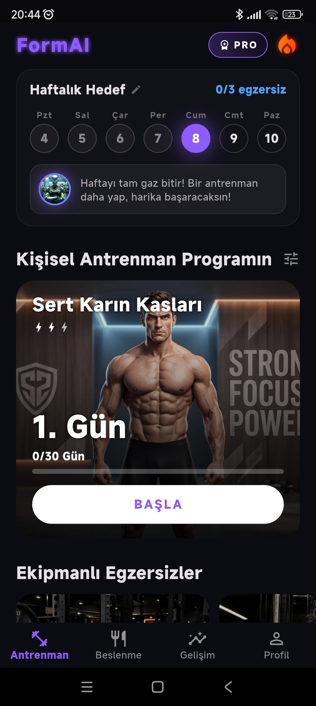
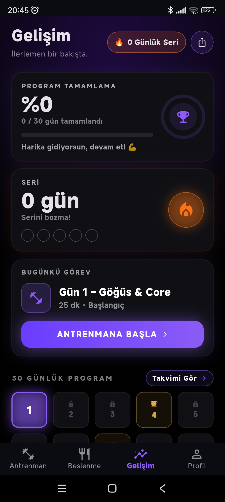
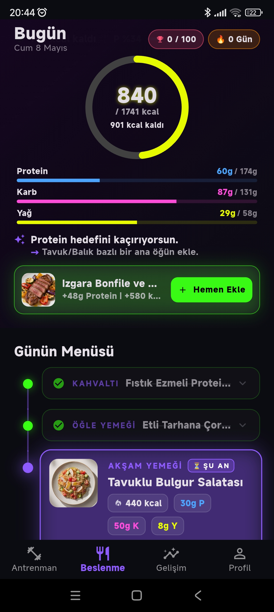
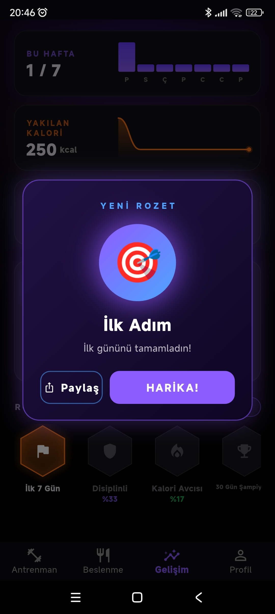
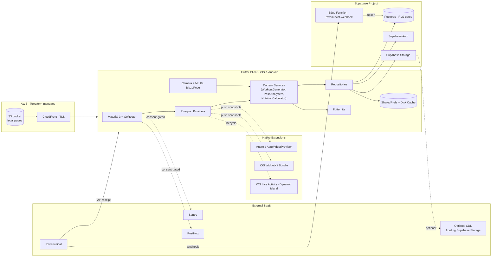
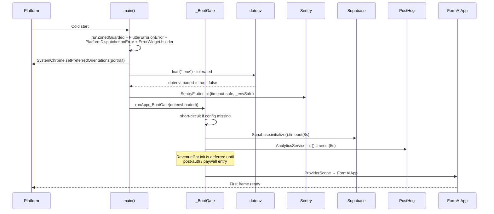
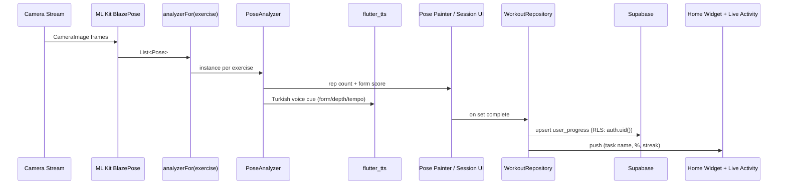
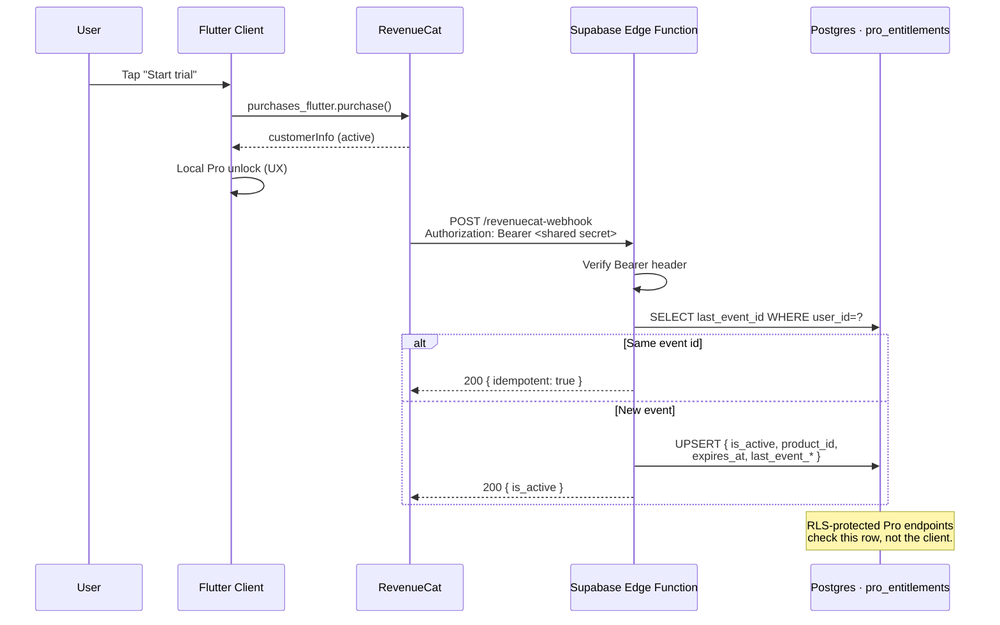

<div align="center">

# SixPack AI · FormAI

**A camera-driven AI fitness coach.** One Flutter codebase. On-device pose analysis. RLS-first Supabase backend. Native widgets, Live Activities, and a server-mirrored RevenueCat entitlement loop.

[](https://flutter.dev)
[](https://dart.dev)
[](https://supabase.com)
[](https://riverpod.dev)
[](https://developers.google.com/ml-kit/vision/pose-detection)
[](https://www.revenuecat.com)
[](https://www.terraform.io)
[](.github/workflows/ci.yml)
[](LICENSE)

<sub>~61 KLOC of Dart · 177 source files · 8 pose analyzers · 138-exercise catalogue · 4 Postgres migrations · 1 Deno Edge Function · Terraform-managed AWS edge for legal hosting</sub>

</div>

<p align="center">
  
  
  
  
  
</p>

---

## Overview

**SixPack AI** (shipped as **FormAI**) is a cross-platform mobile fitness application that pairs a 30-day personalised training programme with **on-device, camera-based pose analysis** for live rep counting and form correction. The app ships from a single Flutter codebase to iOS and Android, with Turkish-language onboarding, a Supabase-backed catalogue, RevenueCat-managed subscriptions, and native home-screen widgets / iOS Live Activities for the active session.

The project is engineered for production: a four-layer release-build error guard catches every class of bootstrap failure, every user table is RLS-gated end-to-end, observability is wired through Sentry and PostHog behind a KVKK/GDPR consent gate, and the build pipeline is tuned to produce an arm64-only debug APK in ≈7 s of warm incremental build time.

> **Status — pre-launch.** The Internal Testing track is live; production rollout is gated on the items in [`docs/MASTER_LAUNCH_ROADMAP.md`](docs/MASTER_LAUNCH_ROADMAP.md).

---

## Why this project is interesting

A short list of decisions that don't show up in a generic README:

- **The bootstrap is paranoid.** `runZonedGuarded` + `FlutterError.onError` + `PlatformDispatcher.onError` + a branded `ErrorWidget.builder` + a tolerated `dotenv.load` + a try/catch around `SentryFlutter.init` + 8 s / 5 s timeouts on Supabase and PostHog. Every read of `dotenv.env` goes through an `_envSafe` wrapper. The contract is simple: `runApp` is reached exactly once, even when every dependency below it is broken. See [`lib/main.dart:47`](lib/main.dart).
- **The pose engine is rule-based, not magic.** Eight hand-written `PoseAnalyzer` subclasses convert BlazePose landmarks into rep counts and form scores. A factory routes 138 catalogue slugs to whichever analyzer fits — and movements that have no meaningful pose check (mobility holds, jump rope, glute bridges) route to a `SilentHoldAnalyzer` so the app never yells false corrections. See [`lib/features/workout/services/analyzer_factory.dart`](lib/features/workout/services/analyzer_factory.dart).
- **Entitlements are server-of-truth, not client-of-truth.** The Flutter client reads RevenueCat's `customerInfo` for UX, but a Deno Edge Function mirrors every RC event into a Postgres `pro_entitlements` table with idempotency on `last_event_id`. RLS-protected Pro endpoints check the server-side row. See [`supabase/functions/revenuecat-webhook/index.ts`](supabase/functions/revenuecat-webhook/index.ts).
- **Pro plans never include gym equipment.** A runtime invariant — `_assertNoGymEquipment` — fires an error log if any barbell/cable/machine slug slips into a generated 30-day home plan. The check exists because the catalogue and the generator are owned by different surfaces and the contract was easy to violate silently. See [`lib/features/workout/domain/services/workout_generator_service.dart:318`](lib/features/workout/domain/services/workout_generator_service.dart).
- **Native code owns presentation, Flutter owns lifecycle.** Home-screen widgets (Kotlin `AppWidgetProvider` + SwiftUI `WidgetBundle`) and the iOS Live Activity (Dynamic Island) are real native targets. Dart drives lifecycle events via `home_widget` / `live_activities`; SwiftUI / Kotlin draws the surface. The App Group `group.app.formai.shared` bridges both sides.
- **Privacy is a build-time concern, not a checkbox.** Sentry's `beforeSend` drops every event until consent is granted, then nulls `user.email` / `user.ipAddress` / `user.data` on every event that does ship. PostHog only initialises after the consent gate. The age gate sits in front of all of it.

---

## System Architecture



### Layered conventions inside `lib/`

Feature-first directories (`auth`, `onboarding`, `workout`, `nutrition`, `progress`, `monetization`, `referral`, `feedback`, `admin`, `home`), each repeating the same internal slices:

```
features/<feature>/
├── data/              # Repositories, Supabase adapters, local cache
├── domain/            # Pure Dart services & value objects (no Flutter)
├── models/            # Plain data classes
├── providers/         # Riverpod providers (state + invalidation)
├── services/          # Feature-scoped services (e.g. pose analyzers)
└── presentation/      # Screens + widgets, watches providers only
```

Cross-cutting concerns live in [`lib/core/`](lib/core) (routing, theme, motion primitives, services, widgets, utils).

---

## Cold-Start Sequence

`main()` boots through a `_BootGate` widget in a fixed order so that a single missing dependency cannot black-screen the app.



The sequence is documented in detail inside [`lib/main.dart`](lib/main.dart); the inline comments trace each layer back to the production incident that motivated it.

---

## Workout Session Pipeline

A live session is a tight loop between the camera, the analyzer, and three side effects (TTS, UI, persistence). The pipeline is per-exercise — `analyzerFor(exercise)` always returns a fresh instance so set transitions never carry rep state across boundaries.



The analyzer factory's per-slug routing — including which movements deliberately bypass any pose check — is in [`lib/features/workout/services/analyzer_factory.dart`](lib/features/workout/services/analyzer_factory.dart).

---

## Subscription & Entitlement Flow

The client trusts RevenueCat for UX gating but the server keeps an authoritative copy. Idempotency is enforced on `last_event_id` so RevenueCat's retry-storms (up to ~3 days for non-2xx) never corrupt state.



Server-side mirror schema: [`supabase/migrations/003_create_pro_entitlements.sql`](supabase/migrations/003_create_pro_entitlements.sql). Webhook handler: [`supabase/functions/revenuecat-webhook/index.ts`](supabase/functions/revenuecat-webhook/index.ts).

---

## Tech Stack

**Mobile client**

| Layer | Choice | Notes |
|---|---|---|
| Framework | Flutter 3.22+ / Dart 3.4+ | Single codebase, iOS + Android + web (admin) |
| State | `flutter_riverpod` 3.3 | `Notifier` / `AsyncNotifier`, no string keys |
| Routing | `go_router` 17.2 | Auth / admin / age / consent redirect rules |
| UI | Material 3 + theme-mode provider | Light + dark + system, with neon brand layer |
| Media | `cached_network_image` + `flutter_cache_manager` | Shared disk cache for images and exercise videos |

**On-device AI / camera**

| Component | Library | Purpose |
|---|---|---|
| Capture | `camera` 0.12 | Portrait-locked preview |
| Pose | `google_mlkit_pose_detection` 0.14 | BlazePose landmarks per frame |
| Voice | `flutter_tts` 4.0 | Turkish form cues |
| Wake | `wakelock_plus` | Holds screen during session |
| Analyzers | 8 hand-written `PoseAnalyzer` subclasses | Routes to 138 catalogue slugs |

**Backend & data**

| Component | Choice | Notes |
|---|---|---|
| Database | Supabase Postgres | 4 numbered migrations + ~14 SQL patches |
| Auth | Supabase Auth | Email/password, Google Sign-In, Sign in with Apple, anonymous |
| Storage | Supabase Storage | `exercises`, `recipes_images`, `exercises_media` buckets |
| Edge | Deno (Supabase) | `revenuecat-webhook` handler with idempotency |
| RLS | Every user table | `auth.uid() = user_id` + admin via JWT claim |
| CDN | Optional | `CDN_BASE_URL` rewrites Storage URLs |

**Monetization**

| Component | Detail |
|---|---|
| SDK | `purchases_flutter` 8.1 |
| SKUs | `formai_pro_monthly` · `formai_pro_3month` · `formai_pro_annual` |
| Server mirror | `public.pro_entitlements` (RLS, read-own) |
| Webhook | Bearer-token-gated Deno function |

**Observability & consent**

| Component | Detail |
|---|---|
| Crash reporting | `sentry_flutter` 9.6 · `tracesSampleRate: 0.2` · PII-scrubbed `beforeSend` |
| Product analytics | `posthog_flutter` 5.3 behind a typed event facade |
| ATT | `app_tracking_transparency` for iOS 14.5+ |
| Consent gate | KVKK/GDPR screen before any event leaves the device |

**Native extensions**

| Surface | Native target | Bridge |
|---|---|---|
| Android home-screen widget | Kotlin `FormAIHomeWidgetProvider` | `home_widget` 0.7 |
| iOS home-screen widget | SwiftUI `FormAIWidgetBundle` | `home_widget` 0.7, App Group `group.app.formai.shared` |
| iOS Live Activity / Dynamic Island | SwiftUI `WorkoutLiveActivityView` | `live_activities` 2.4 |

**Infrastructure**

| Component | Choice | Notes |
|---|---|---|
| Legal hosting | Terraform → S3 + CloudFront | `PriceClass_100`, default `*.cloudfront.net` TLS, `redirect-to-https` |
| CI | GitHub Actions (×2 workflows) | Format / analyze / test on PR; debug APK build on push |

---

## Project Structure

```
SixPack-AI/
├── lib/
│   ├── main.dart                        # _BootGate + FormAIApp shell
│   ├── core/
│   │   ├── routing/                     # GoRouter + auth/admin/age/consent gates
│   │   ├── services/                    # Analytics, deep links, notifications,
│   │   │                                #   live activity, widget sync, share
│   │   ├── theme/                       # Material 3 + theme-mode provider
│   │   ├── motion/                      # Hand-coded animation primitives
│   │   ├── widgets/                     # Skeleton loaders, branded fallbacks
│   │   └── utils/                       # Logger, haptics, helpers
│   └── features/
│       ├── auth/                        # Email + OAuth + session listener
│       ├── onboarding/                  # Cinematic 5-act wizard + AI engine
│       ├── workout/
│       │   ├── services/                # 8 pose analyzers + factory
│       │   ├── domain/                  # WorkoutGeneratorService
│       │   └── presentation/            # Camera screen + pose painter
│       ├── nutrition/                   # Recipes, macros, next-best-meal
│       ├── progress/                    # Calendar, badges, year-in-review
│       ├── monetization/                # Paywall, churn survey, RC client
│       ├── referral/                    # Referral codes + redeem flow
│       ├── feedback/                    # In-app feedback service
│       ├── admin/                       # Web-only CRUD dashboard
│       └── home/                        # Dashboard tabs
│
├── android/app/src/main/kotlin/…/widget/    # AppWidgetProvider (home-screen tile)
├── ios/
│   ├── FormAIWidget/                        # SwiftUI WidgetKit bundle
│   └── FormAILiveActivity/                  # SwiftUI Live Activity / Dynamic Island
│
├── supabase/
│   ├── migrations/                          # 4 numbered migrations (RLS-first)
│   ├── functions/revenuecat-webhook/        # Deno edge function
│   └── sql/                                 # Seed + backfill patches
│
├── terraform/legal_pages/                   # S3 + CloudFront for terms/privacy
├── web/public/                              # terms.html + privacy.html (legal)
├── scripts/                                 # dev-run.sh, dev-attach.sh, diagnostics
├── docs/                                    # Architecture, ops, roadmap, audits
├── photos/                                  # Onboarding + exercise WebP assets
├── test/ + integration_test/                # Unit + on-device E2E
└── .github/workflows/                       # ci.yml + flutter_ci.yml
```

---

## Local Development

### Prerequisites

| Tool | Version |
|---|---|
| Flutter SDK | 3.22 or later (Dart ≥ 3.4) |
| Android SDK | API 34 / NDK 25, Java 17 (Temurin) |
| Xcode | 15+ for iOS / Live Activities |
| Supabase CLI | Latest, for migrations + Edge Functions |
| Terraform | ≥ 1.5 (only if deploying legal pages infra) |
| Deno | ≥ 1.40 (only if iterating on Edge Functions) |

### 1 · Clone and install dependencies

```bash
git clone https://github.com/emredogan-cloud/SixPack-AI-30-Gunde-Karin-Kasi.git
cd SixPack-AI-30-Gunde-Karin-Kasi
flutter pub get
```

### 2 · Configure environment

```bash
cp .env.example .env
# Fill in SUPABASE_URL, SUPABASE_ANON_KEY, RevenueCat keys, etc.
```

`.env` is loaded by `flutter_dotenv` at boot and bundled as a Flutter asset. A blank `.env` is tolerated — Supabase calls degrade and the boot screen renders the configuration-error surface instead of hanging.

### 3 · Apply Supabase schema (optional — only if you own a Supabase project)

```bash
supabase link --project-ref <your-ref>
supabase db push                              # applies supabase/migrations/*.sql
supabase functions deploy revenuecat-webhook
supabase secrets set REVENUECAT_WEBHOOK_SECRET=<shared-secret>
```

### 4 · Run on device

```bash
# Fast dev cycle (arm64-only debug APK, hot-reload attached)
scripts/dev-run.sh

# Reconnect to an already-installed build without reinstalling
scripts/dev-attach.sh

# iOS
open ios/Runner.xcworkspace
```

`dev-run.sh` builds `--split-per-abi --target-platform android-arm64` for a 203 MB APK (≈37 % smaller than the universal APK), disables MIUI Play Protect verification on the device for the install window, and re-enables it afterwards. Warm incremental builds land in ≈7 s.

---

## Environment Variables

| Variable | Purpose | Required |
|---|---|---|
| `SUPABASE_URL` | Project URL (`https://<ref>.supabase.co`) | Yes |
| `SUPABASE_ANON_KEY` | Public anon JWT | Yes |
| `REVENUECAT_IOS_KEY` | RC public iOS SDK key | iOS only |
| `REVENUECAT_ANDROID_KEY` | RC public Android SDK key | Android only |
| `SENTRY_DSN` | Sentry crash-reporting DSN | Production |
| `POSTHOG_API_KEY` | PostHog write key | Production |
| `POSTHOG_HOST` | EU or US endpoint | Production |
| `CDN_BASE_URL` | Optional CDN that fronts Supabase Storage. Falls back to public Storage URLs when empty. | No |

Edge Function secrets (set via `supabase secrets set …`):

| Variable | Purpose |
|---|---|
| `REVENUECAT_WEBHOOK_SECRET` | Shared secret matching the RC dashboard `Authorization` header |
| `SUPABASE_SERVICE_ROLE_KEY` | Service-role JWT — used only inside the Edge Function, never shipped client-side |

---

## Build & Deployment

### Android

```bash
flutter build apk --release --split-per-abi --target-platform android-arm64
flutter build appbundle --release
```

ProGuard / R8 keeps are configured for Supabase + kotlinx-serialization. Release builds sign with `android/app/upload-keystore.jks`; the keystore password lives in `android/key.properties` (gitignored).

### iOS

`ios/Runner.xcworkspace` contains three targets, all sharing the App Group `group.app.formai.shared`:

- **Runner** — the Flutter shell
- **FormAIWidget** — SwiftUI WidgetKit bundle
- **FormAILiveActivity** — Dynamic Island Live Activity

### Web (admin only)

```bash
flutter build web --release
```

The web build exposes only `/admin`; mobile-only screens are guarded by a platform check. Host the output behind any static host that can enforce HTTPS + a Supabase admin-claim CORS allowlist.

### Supabase Edge Functions

```bash
supabase functions deploy revenuecat-webhook
```

### Legal pages (Terraform)

```bash
cd terraform/legal_pages
terraform init
terraform apply
```

Provisions an S3 bucket + CloudFront distribution that serves `web/public/terms.html` and `web/public/privacy.html` with TLS terminated on the default `*.cloudfront.net` certificate. CloudFront is set to `PriceClass_100` (NA + EU edges only).

---

## Infrastructure

| Component | Where | Notes |
|---|---|---|
| App database | Supabase Postgres | 7 migrations (`001` initial schema … `005` video_analysis, `006` delete_user RPC, `007` referrals) |
| RLS | All user tables | `auth.uid() = user_id` policies; admin role via JWT claim |
| Object storage | Supabase Storage | Migration-managed buckets: `recipes_images`, `user_videos`; exercise-media buckets seeded out-of-band (`supabase/sql/`) |
| Server-side IAP | Deno Edge Function | RevenueCat webhook → `pro_entitlements` upsert with replay protection (`last_event_id`) |
| Legal hosting | AWS S3 + CloudFront | Terraform-managed; HTTPS-only, 5-minute cache |
| CI | GitHub Actions | `ci.yml` (format/analyze/test/debug-APK/emulator integration) + `release.yml` (tagged release AAB/APK) + `secret-scan.yml` (gitleaks) |

---

## Security

- **No secrets in source.** `.env`, GCP service-account JSON, signing keystores, and the upload cert are all gitignored. The Python miner script that embeds a RapidAPI key is excluded from version control.
- **RLS-first.** Every user-scoped table enables RLS and ships with `select_own / insert_own / update_own / delete_own` policies before its first row is inserted.
- **Server-side entitlements.** Subscription state is mirrored from RevenueCat into Postgres by a service-role Edge Function. The client never trusts itself on Pro gating — RLS-protected endpoints check `pro_entitlements`.
- **Admin storage RLS.** Migration `004_admin_storage_rls.sql` closes the earlier gap where any authenticated user could `uploadBinary` into the admin buckets. Writes now require the admin JWT claim; SELECT stays public so videos keep loading without auth.
- **PII scrubbing on observability.** Sentry's `beforeSend` nulls `user.email`, `user.ipAddress`, and `user.data`; events default to anonymous.
- **KVKK / GDPR consent gate** sits between age verification and onboarding. No PostHog event fires and no Sentry crash forwards until the user has explicitly opted in.
- **Predictive back gesture** + system-back guards (`PopScope`) prevent accidental loss of wizard progress.
- **ML Kit availability probe** at runtime — pose detection degrades to a non-camera workout flow on forks without Google Play Services.

---

## Performance

- **Build pipeline** — `--split-per-abi --target-platform android-arm64` cuts APK size 37 % and saves a matching slice of dexopt time on every install. Gradle JVM tuned to `-Xmx4G` after Phase 117 caught a 4.9 GB swap regression.
- **Bootstrap budget** — Supabase init capped at 8 s, PostHog at 5 s; RevenueCat init deferred until after first auth.
- **Image cache** — `cached_network_image` everywhere; `flutter_cache_manager` promoted to a direct dep so exercise videos share the same disk cache.
- **Asset hygiene** — non-recursive `photos/` asset declaration; reference imagery routed to `docs/reference-imagery/` to keep the APK lean (caught a 4.6 MB regression in Phase 127).
- **Skeleton loaders** — `shimmer`-driven placeholders replace spinners across recipe grids, the 30-day grid, and plan-detail lists.
- **Pose detector** — single allocation per session; portrait-lock prevents the tensor re-alloc that previously froze low-end devices on rotation.

---

## CI/CD

- **`ci.yml`** — the ONE workflow of record (pushes to `main`/`staging`/`feature/*`/`prisk/*` + PRs). Jobs: `test` (format gate → env secret-guard → analyze → `flutter test --coverage` → lcov artifact), `build-apk` (debug APK smoke), `integration` (API-34 emulator run of `integration_test/`). `flutter_ci.yml` was consolidated into it and deleted.
- **`release.yml`** — tag `v*` / manual. Injects the client-public `.env` from CI secrets, runs the secret-guard + analyze + tests, builds release AAB+APK, warns loudly if artifacts would be debug-signed, uploads artifacts. Play-upload step is prepared behind repository secrets.
- **`secret-scan.yml`** — gitleaks over full history + `.env.example` guard on every push/PR.
- **No production secrets reach `ci.yml`** — it runs on `touch .env`; only `release.yml` receives the client-public key set.

---

## Testing

| Layer | Where | What it covers |
|---|---|---|
| Unit | [`test/`](test) | Pure-Dart services (generator, calculator, analyzers) |
| Widget | [`test/`](test) | Critical screen rendering + provider wiring |
| Integration | [`integration_test/`](integration_test) | Mocked navigation harness mirroring the happy path (CI-safe; real-device E2E tracked on the external ledger) |
| Manual smoke | `scripts/dev-run.sh release` | Pre-commit release sanity check |

```bash
flutter test                              # unit + widget (CI does the same)
flutter test integration_test/            # on-device E2E
```

---

## Documentation

Engineering documentation lives under [`docs/`](docs). The high-signal entry points:

- [`docs/MASTER_LAUNCH_ROADMAP.md`](docs/MASTER_LAUNCH_ROADMAP.md) — pre-launch checklist
- [`docs/PROJECT_DOCUMENTATION.md`](docs/PROJECT_DOCUMENTATION.md) — architecture deep-dive
- [`docs/MONETIZATION_LAUNCH_GUIDE.md`](docs/MONETIZATION_LAUNCH_GUIDE.md) — RC + paywall ops
- [`docs/OPERATOR_REVIEWER_ACCESS.md`](docs/OPERATOR_REVIEWER_ACCESS.md) — store-review Pro access runbook
- [`docs/AI_CONTEXT_REPORT.md`](docs/AI_CONTEXT_REPORT.md) — onboarding context for new contributors

---

## Roadmap

The launch backlog is tracked in [`docs/MASTER_LAUNCH_ROADMAP.md`](docs/MASTER_LAUNCH_ROADMAP.md). The current pre-launch checklist covers:

- Production RevenueCat dashboard wiring and product approval
- Sentry + PostHog production DSNs + EU project routing
- Supabase production SQL apply + storage policy verification
- Hosted privacy / terms URLs propagated to Play Console + App Store Connect
- Localization pass for English-market expansion (currently TR-only)
- Optional Rive-backed living-coach avatar (interface already adapter-shaped — see `LivingCoachAvatar` docstring)

---

## Contributing

This repository is part of a personal engineering portfolio and is not currently accepting external contributions. For licensing or commercial inquiries, reach out via the maintainer profile on GitHub.

Engineering guidelines that apply to every diff land in [`CLAUDE.md`](CLAUDE.md): think before coding, simplicity first, surgical changes, goal-driven execution.

---

## License

Released under the [MIT License](LICENSE).

---

<div align="center">

**Built by [Emre Doğan](https://github.com/emredogan-cloud)** · Cloud Architecture · SaaS Engineering · Mobile · AI Systems

</div>
